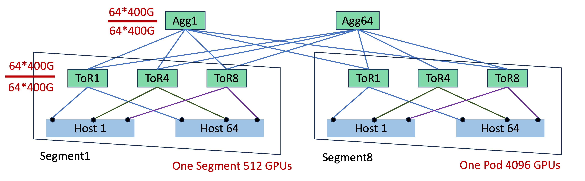
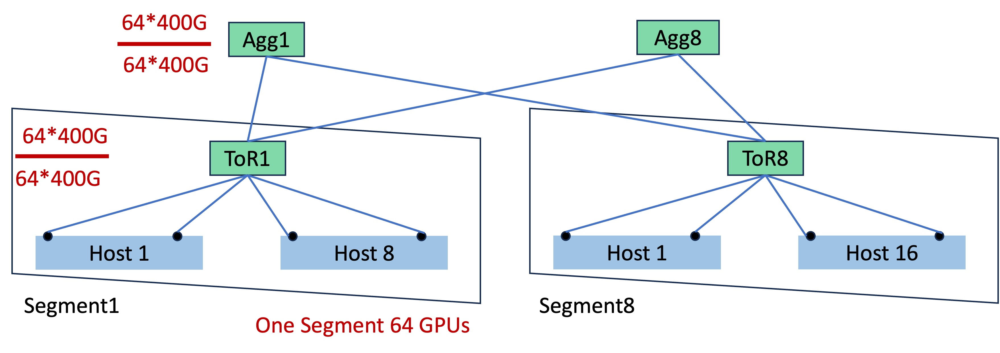
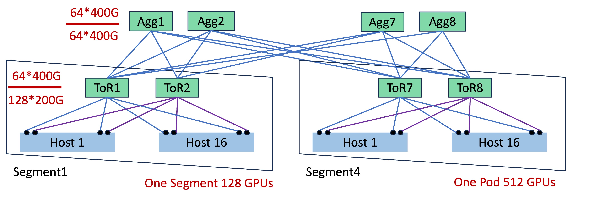
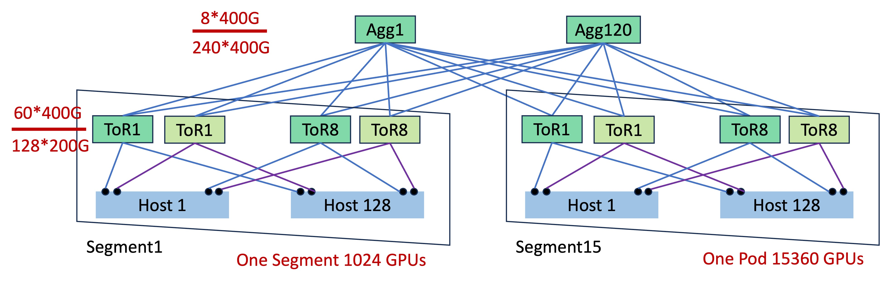
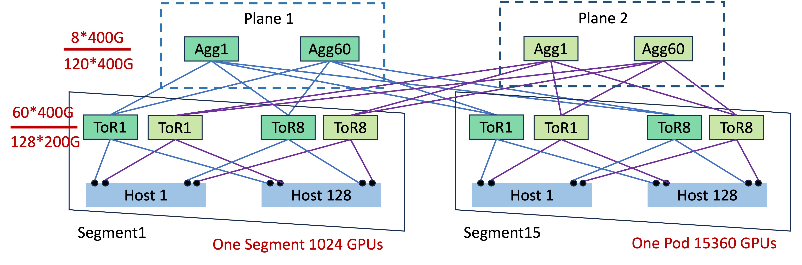
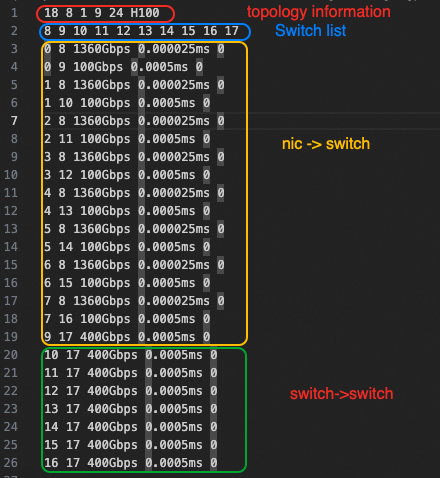
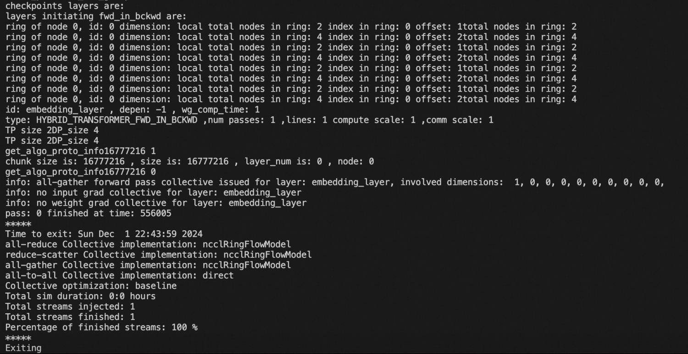

> 本文为 [Tutorial.md](../Tutorial.md) 的中文翻译，以英文版本为准。

# 简介

SimAI 是一个综合性的大规模 AI 训练仿真工具包，提供三种主要仿真场景：

1. **SimAI-Analytical** - 一种分析型仿真工具，抽象底层网络通信细节。采用简化方法，使用 busbw（总线带宽）来估算集合/点对点通信的通信时间，实现快速场景验证。主要应用场景包括（但不限于）：

    * *性能分析*：比较不同模型的完成时间（如研究 Expert 数量对 MoE 模型训练性能的影响）

    * *框架级并行参数优化*：平衡和优化 TP/EP/PP 参数，分析端到端时延效果

    * *Scale-up 探索*：研究特定场景优化中不同 scale-up 域的并行参数性能

    * *Scale-out 带宽选择*：研究不同 GPU 性能下的性价比带宽配置

> 💡 *当前支持手动配置 busbw.yaml。基于并行场景的自动 busbw 推断即将开源。敬请关注，欢迎联系我们了解更多详情。✨*

2. **SimAI-Simulation(NS-3)** - 一种高保真全栈仿真工具，理论上可与任何纯网络模拟器集成。提供 LLM 训练过程中通信行为的细粒度还原。当前支持 NS-3 作为网络后端（我们鼓励集成新的网络仿真工具）。主要研究方向包括：

    * *集合通信算法研究*：为非交换机架构和其他新兴网络拓扑设计和优化集合通信流量模式
    
    * *网络协议研究*：评估和优化不同架构下的网络协议、拥塞控制算法、路由机制等底层网络技术
    
    * *新型网络架构设计*：探索创新性网络架构

> 💡 我们强烈鼓励研究人员基于 SimAI-Simulation 进行创新扩展和突破性研究，发表于顶级会议。加入我们的社区或通过邮件联系我们——我们致力于为有前景的研究方向提供技术支持！✨

3. **SimAI-Physical(TODO)**

各组件的更多功能请参考 [SimCCL](https://github.com/aliyun/SimCCL) 和 [ns-3-alibabacloud](https://github.com/aliyun/ns-3-alibabacloud)。

# 🛠️ 环境搭建

通常情况下，运行 SimAI 需要使用 [AICB](https://github.com/aliyun/aicb?tab=readme-ov-file#generate-workloads-for-simulation-simai) 工具生成 Workload 文件。为创建精确的 Workload，您可能需要使用 AIOB 功能确定各计算 kernel 的时间，这需要 GPU 环境。因此，我们建议直接在最新的 **NGC 镜像**中运行 SimAI 全栈工具包。

> 💡 **重要提示**：SimAI-Simulation 编译需要移除 ninja（NGC 镜像中预装）。使用以下命令移除：
> ```bash
> apt remove ninja-build && pip uninstall ninja
> ```

编译指南：

```bash
# Clone the repository
$ git clone https://github.com/aliyun/SimAI.git
$ cd ./SimAI/

# Clone submodules
$ git submodule update --init --recursive
# Make sure to use the newest commit
$ git submodule update --remote

# Compile SimAI-Analytical
$ ./scripts/build.sh -c analytical

# Compile SimAI-Simulation (ns3)
$ ./scripts/build.sh -c ns3
```

# 🌐 SimAI-Analytical 使用方法
## 📝 Workload 生成

使用 [AICB](https://github.com/aliyun/aicb) 中的 [SimAI-WorkloadGenerator](https://github.com/aliyun/aicb?tab=readme-ov-file#generate-workloads-for-simulation-simai) 功能生成仿真用工作负载。这将产生类似 [workload_analytical.txt](../../example/workload_analytical.txt) 的 `.txt` 文件，包含：

- `model_parallel_NPU_group`：表示 Tensor Parallelism 大小
- `ep`：表示 Expert 模型并行大小
- `pp`：表示流水线模型并行大小
- `vpp`：Virtual Pipeline Parallelism（默认：`--num-layers-per-virtual-pipeline-stage=1`，实现最小 PP bubble）

> 💡 *更多详情请参考 [AICB Workload Tutorial](https://github.com/aliyun/aicb/blob/master/training/tutorial.md#workload)*

## 🔧 Busbw 设置

SimAI-Analytical 通过直接指定 busbw 来估算集合通信时间，从而抽象底层网络细节。要为不同场景自定义通信 busbw，可使用如下格式的 [busbw.yaml](../../example/busbw.yaml) 文件：

```yaml
test
TP:
  allreduce,: 300      # TP 中 AllReduce busbw 300GB/s
  allgather,: 280
  reducescatter,: 280
  alltoall,: 230
DP:
  allreduce,: null
  allgather,: 380      # DP 中 AllGather busbw 380GB/s
  reducescatter,: 380
  alltoall,: null
EP:
  allreduce,: null
  allgather,: 45       # DP_EP 中 AllGather busbw 45GB/s
  reducescatter,: 45   # DP_EP 中 ReduceScatter busbw 45GB/s
  alltoall,: 80        # EP 中 AlltoAll busbw 80GB/s
```
> 🔍 *对自动 busbw 计算（考虑集群规模、架构、并行参数、小消息调整和延迟）感兴趣？欢迎联系讨论！* ✨

## 🖥️ Analytical 仿真

使用以下命令运行 analytical 仿真：

```bash
$ ./bin/SimAI_analytical -w example/workload_analytical.txt -g 9216 -g_p_s 8 -r test- -busbw example/busbw.yaml
```

### 必需参数

| 参数 | 完整形式 | 描述 |
|:---------:|:----------|:------------|
| `-w` | `--workload` | 指定 Workload 文件路径 |
| `-g` | `--gpus` | 指定仿真 GPU 规模 |
| `-g_p_s` | `--gpus-per-server` | 指定 Scale-up 大小 |
| `-r` | `--result` | 指定输出文件路径和前缀（默认：`./results/`）<br>建议包含仿真参数，如<br>`A100-llama405b-tp8-pp16-dp128-ga16-ep1-NVL8` |
| `-busbw` | `--bus-bandwidth` | 指定 busbw 文件路径<br>（建议直接修改 `example/busbw.yaml`） |

### 可选参数

| 参数 | 完整形式 | 描述 |
|:---------:|:----------|:------------|
| `-v` | `--visual` | 是否生成可视化文件 |

### 通信组重叠比例

以下参数指定通信组的重叠比例（默认：0，表示无重叠）：

| 参数 | 完整形式 | 描述 | 范围 |
|:---------:|:----------|:------------|:------|
| `-dp_o` | `--dp-overlap-ratio` | DP 重叠比例 | [0.0-1.0] |
| `-ep_o` | `--ep-overlap-ratio` | EP 重叠比例 | [0.0-1.0] |
| `-tp_o` | `--tp-overlap-ratio` | TP 重叠比例 | [0.0-1.0] |
| `-pp_o` | `--pp-overlap-ratio` | PP 重叠比例 | [0.0-1.0] |

> 📝 *由于重叠策略多样且重叠比例依赖场景，我们优先使用简单高效的方式直接指定重叠条件。*


## 结果分析

### 原始数据

正常运行 SimAI-Analytical 将生成如下图所示的 CSV 输出。

第二行包含摘要信息，包括暴露时间以及每个通信组的计算时间的绝对值和百分比，以及一次迭代的端到端时间。下面是每个具体层的操作详情。


### 可视化

如果运行 SimAI-Analytical 时指定 `-v`，将生成以下内容：


# SimAI-Simulation 使用方法
## 📝 Workload 生成

使用与 SimAI-Analytical 相同的 workload，由 [AICB](https://github.com/aliyun/aicb) 中的 [SimAI-WorkloadGenerator](https://github.com/aliyun/aicb?tab=readme-ov-file#generate-workloads-for-simulation-simai) 功能生成。

## 🔧 TOPO 设置
运行 SimAI-Simulator 前，需要生成 ns-3-alibabacloud 可识别的拓扑文件。
### 拓扑模板
为增强便利性，我们提供了5种常见架构的模板，包括 Spectrum-X、单平面 AlibabaHPN、双平面 Alibaba HPN 和 DCN+。可设置参数 `-topo`。以下五张图给出了概览。
如需了解更多关于 dual-ToR 和 dual-plane 的信息，请阅读 [HPN 7.0](https://ennanzhai.github.io/pub/sigcomm24-hpn.pdf) 的文章。
<table>
  <tr>
    <td><br><p>Spectrum-X（一个 Pod）</p></td>
  </tr>
  <tr>
    <td><br><p>DCN+SingleToR（一个 Pod）</p></td>
    <td><br><p>DCN+DualToR（一个 Pod）</p></td>    
  </tr>
  <tr>
    <td><br><p>单平面 AlibabaHPN（一个 Pod）</p></td>
    <td><br><p>双平面 AlibabaHPN（一个 Pod）</p></td>
    
  </tr>
</table>


以下命令生成图中所示的 8 GPU Spectrum-X 拓扑：
```bash
python3 ./astra-sim-alibabacloud/inputs/topo/gen_Topo_Template.py -topo Spectrum-X -g 8 -psn 1
```


以下表格给出了各层级参数的描述，并展示了每个模板的默认参数。用户可更改 `-topo` 名称和对应的 `-g` 来生成相应结构的拓扑。注意，如果未输入 gpu 数量，则会生成每个模板一个 Pod 的拓扑。
（当前不支持超过一个 Pod 的 GPU 规模。）

| 参数层级 | 参数 | 描述 |
|-----------------|------------|-------------|
| 整体结构 | `-topo` | 拓扑模板 |
|                 | `-g` | GPU 数量 |
|                 | `--dp` | 启用双平面，默认单平面 |
|                 | `--ro` | 启用 rail-optimized |
|                 | `--dt` | 启用双网卡和双 ToR |
|                 | `-er` | 错误率 |
| 主机内部 | `-gps` | 每服务器 GPU 数 |
|                 | `-gt` | GPU 类型 |
|                 | `-nsps` | 每服务器 NV switch 数 |
|                 | `-nvbw` | NVLink 带宽 |
|                 | `-nl` | NVLink 延迟 |
|                 | `-l` | NIC 延迟 |
| 段内 | `-bw` | NIC 到 ASW 带宽 |
|                 | `-asw` | ASW 交换机数量 |
|                 | `-nps` | 每交换机 NIC 数（每 ASW 连接的 GPU 数） |
| Pod 内 | `-psn` | PSW 交换机数量 |
|                 | `-apbw` | ASW 到 PSW 带宽 |
|                 | `-app` | 每 PSW 的 ASW 数 |


| 参数层级 | 参数 | Spectrum-X | AlibabaHPN 单平面 | AlibabaHPN 双平面 | DCN+ 双平面 | DCN+ 单平面 |
|-----------------|------------|-------------|-------------------------|-----------------------|---------------|---------------|
| 整体结构 | `-topo` | `Spectrum-X`| `AlibabaHPN` | `AlibabaHPN` | `DCN+` | `DCN+` |
|                 | `-g` | 4096 | 15360 | 15360 | 512 | 512 |
|                 | `--dp` | false | false | true | false | false |
|                 | `--ro` | true | true | true | false | false |
|                 | `--dt` | false | true | true | true | false |
|                 | `-er` | 0 | 0 | 0 | 0 | 0 |
| 主机内部 | `-gps` | 8 | 8 | 8 | 8 | 8 |
|                 | `-gt` | H100 | H100 | H100 | H100 | A100 |
|                 | `-nsps` | 1 | 1 | 1 | 1 | 1 |
|                 | `-nvbw` | 2880Gbps | 2880Gbps | 2880Gbps | 2880Gbps | 2880Gbps |
|                 | `-nl` | 0.000025ms | 0.000025ms | 0.000025ms | 0.000025ms | 0.000025ms |
|                 | `-l` | 0.0005ms | 0.0005ms | 0.0005ms | 0.0005ms | 0.0005ms |
| 段内 | `-bw` | 400Gbps | 200Gbps | 200Gbps | 200Gbps | 400Gbps |
|                 | `-asw` | 64 | 120 | 120 | 2 | 1 |
|                 | `-nps` | 64 | 128 | 128 | 128 | 64 |
| Pod 内 | `-psn` | 64 | 120 | 120 | 8 | 4 |
|                 | `-apbw` | 400Gbps | 400Gbps | 400Gbps | 400Gbps | 400Gbps |
|                 | `-app` | 64 | 240 | 120 | 8 | 4 |

可根据不同的 `-topo` 名称和参数生成各模板的拓扑：
对于 64 GPU、16 asn、16 psn 的双平面 AlibabaHPN，使用以下命令：
```bash
python3 ./astra-sim-alibabacloud/inputs/topo/gen_Topo_Template.py -topo AlibabaHPN --dp -g 64 -asn 16 -psn 16
```
对于 128 GPU、2 asn、8 psn 的双 ToR DCN，使用以下命令：
```bash
python3 ./astra-sim-alibabacloud/inputs/topo/gen_Topo_Template.py -topo DCN+ --dt -g 128 -asn 2 -psn 8
```
请注意 `--ro` `--dt` `--dp` 对 `Spectrum-X` 无效（固定为 Rail-Optimized Single-ToR Single Plane），`--ro` `--dt` 对 `AlibabaHPN` 无效（Rail-Optimized 双平面，可为单平面或双平面），`--ro` `--dp` 对 `DCN+` 无效（非 Rail-Optimized 单平面，可为 Single ToR 或 Dual ToR）。

用户可自定义拓扑。例如，如果要构建一个 32 GPU、200Gbps 带宽、A100、8 psn 的 rail-optimized single ToR 拓扑，输入以下命令：
```bash
python3 ./astra-sim-alibabacloud/inputs/topo/gen_Topo_Template.py -g 32 -bw 200Gbps -gt A100 -psn 8 --ro
```

## 🖥️ SimAI-NS3 仿真

```bash
$ AS_SEND_LAT=3 AS_NVLS_ENABLE=1 ./bin/SimAI_simulator -t 16 -w ./example/microAllReduce.txt -n  ./Spectrum-X_8g_8gps_400Gbps_H100  -c astra-sim-alibabacloud/inputs/config/SimAI.conf
```

| 环境变量名 | 描述 | 默认值 |
|---------------------------|----------------------------------|-------------------------------------------|
| `AS_LOG_LEVEL` | 日志级别 | `DEBUG`, `INFO`, `WARNING`, `ERROR`, `UNKNOWN`；默认为 `INFO` |
| `AS_PXN_ENABLE` | 启用 PXN | `0/1`；默认为 `false` |
| `AS_NVLS_ENABLE` | 启用 NVLS | `0/1`；默认为 `false` |
| `AS_SEND_LAT` | 设置数据包发送延迟 | 默认为 `6`，单位为 `us` |
| `AS_NVLSTREE_ENABLE` | 启用 NVLSTREE | 默认为 `false` |

| 参数 | 描述 | 默认值 |
|----------------------------|------------------------------------------|--------------------------------------------------------------------|
| `-t  --thread` | 多线程加速的线程数 | 默认为 `1`；如启用多线程，控制线程数在 `8` 到 `16` 之间。|
| `-w  --workload` | workload 路径 | `./microAllReduce.txt` |
| `-n  --network-topo` | 网络拓扑路径 | None |

## RING VS NVLS
### workload
```bash
HYBRID_TRANSFORMER_FWD_IN_BCKWD model_parallel_NPU_group: 8 ep: 1 pp: 1 vpp: 8 ga: 1 all_gpus: 32 checkpoints: 0 checkpoint_initiates: 0
6
embedding_layer     -1 556000  ALLREDUCE   16777216      1       NONE 0        1      NONE   0      1 
embedding_layer     -1 556000  ALLREDUCE   33554432      1       NONE 0        1      NONE   0      1 
embedding_layer     -1 556000  ALLREDUCE   67108864      1       NONE 0        1      NONE   0      1 
embedding_layer     -1 556000  ALLREDUCE   134217728      1       NONE 0        1      NONE   0      1 
embedding_layer     -1 556000  ALLREDUCE   268435456      1       NONE 0        1      NONE   0      1 
embedding_layer     -1 556000  ALLREDUCE   536870912      1       NONE 0        1      NONE   0      1 

```
### NVLS 拓扑文件和运行命令
```bash
cd SimAI
./scripts/build.sh -c ns3
python3 ./astra-sim-alibabacloud/inputs/topo/gen_Topo_Template.py --ro -g 32 -gt H100 -bw 400Gbps -nvbw 1360Gbps 
AS_SEND_LAT=12 AS_NVLS_ENABLE=1 ./bin/SimAI_simulator -t 8 -w ./example/microAllReduce.txt -n ./Rail_Opti_SingleToR_32g_8gps_400Gbps_H100 -c ./astra-sim-alibabacloud/inputs/config/SimAI.conf
```
### RING 拓扑文件和运行命令
```bash
python3 ./astra-sim-alibabacloud/inputs/topo/gen_Topo_Template.py --ro -g 32 -gt H100 -bw 400Gbps -nvbw 1440Gbps
AS_SEND_LAT=2 AS_PXN_ENABLE=1 ./bin/SimAI_simulator -t 8 -w ./example/microAllReduce.txt -n ./Rail_Opti_SingleToR_32g_8gps_400Gbps_H100 -c ./astra-sim-alibabacloud/inputs/config/SimAI.conf
```
### 结果
| 消息大小 | NVLS | RING |
|----------|--------|--------|
| 16M | 148.88 | 141.84 |
| 32M | 178.04 | 153.68 |
| 64M | 197.38 | 160.60 |
| 128M | 208.70 | 163.85 |
| 256M | 214.87 | 165.72 |
| 512M | 218.09 | 166.68 |


## Spectrum-X 架构 VS DCN+ 架构
### workload
```bash
HYBRID_TRANSFORMER_FWD_IN_BCKWD model_parallel_NPU_group: 8 ep: 1 pp: 1 vpp: 8 ga: 1 all_gpus: 256 checkpoints: 0 checkpoint_initiates: 0
1
embedding_layer     -1 556000         NONE 0        1      NONE   0      1 ALLREDUCE   536870912      1
```
### 网络拓扑文件
```bash
# DCN+ 拓扑文件（Single ToR，非 rail-optimized）
python3 ./astra-sim-alibabacloud/inputs/topo/gen_Topo_Template.py -topo DCN+ -g 256 -psn 64 -bw 400Gbps 
# Spectrum 拓扑文件（Single ToR，Rail-optimized）
python3 ./astra-sim-alibabacloud/inputs/topo/gen_Topo_Template.py -topo Spectrum-X -g 256
```
### 运行命令
```bash
# DCN+ 运行命令
AS_SEND_LAT=2 ./bin/SimAI_simulator -t 8 -w ./example/microAllReduce.txt -n ./DCN+SingleToR_256g_8gps_400Gbps_H100 -c ./astra-sim-alibabacloud/inputs/config/SimAI.conf
# HPN7.0 运行命令
AS_SEND_LAT=2 ./bin/SimAI_simulator -t 8 -w ./example/microAllReduce.txt -n ./Spectrum-X_256g_8gps_400Gbps_H100 -c ./astra-sim-alibabacloud/inputs/config/SimAI.conf
```
| 消息大小 | Spectrum-X | DCN-SingleToR |
|----------|-------------|--------------|
| 16M | 33.095585 | 23.332048 |
| 32M | 38.572166 | 25.762846 |
| 64M | 42.049648 | 23.677116 |
| 128M | 44.036110 | 35.209461 |
| 256M | 45.101425 | 36.205692 |
| 512M | 45.653648 | 36.242008 |

# SimAI-Physical 使用方法
当前仿真器兼容 ns3 离散事件模拟器作为网络后端，同时支持物理网络后端用于物理包注入。

## 编译
SimAI-Phy 当前使用 roceV2 协议进行流量生成。编译过程需要依赖与 RDMA 物理设备相关的 libverbs，以及 MPI 程序。编译前，请确认您的环境能成功运行基础的 RDMA perftest 流量生成工具，并支持相关 MPI 程序。
```bash
# Clone the repository
$ git clone https://github.com/aliyun/SimAI.git
$ cd ./SimAI/

# Clone submodules
$ git submodule update --init --recursive
# Make sure to use the newest commit
$ git submodule update --remote

# Compile SimAI-Analytical
$ ./scripts/build.sh -c analytical

# Compile SimAI-Simulation (ns3)
$ ./scripts/build.sh -c ns3

# Compile SimAI-phynet (phynet)
$ sudo yum install openmpi openmpi-devel
$ export MPI_INCLUDE_PATH=/usr/include/openmpi-x86_64/ 
$ export MPI_BIN_PATH=/usr/lib64/openmpi/bin/mpic++	
$ ./scripts/build.sh -c phy
```
## Workload 生成
SimAI-Phy 物理流量生成所需的 workload 与 Sim-Simulation 相同，通过 AICB 生成。

### 示例 workload
```bash
HYBRID_TRANSFORMER_FWD_IN_BCKWD model_parallel_NPU_group: 2 ep: 1 pp: 1 vpp: 8 ga: 1 all_gpus: 2 checkpoints: 0 checkpoint_initiates: 0
10
mlp_norm    	    -1	1055000	 ALLGATHER	  1073741824	1055000	      NONE	         0	1055000	      NONE	         0	       100
mlp_norm    	    -1	1055000	 ALLGATHER	  1073741824	1055000	      NONE	         0	1055000	      NONE	         0	       100
mlp_norm    	    -1	1055000	 ALLGATHER	  1073741824	1055000	      NONE	         0	1055000	      NONE	         0	       100
mlp_norm    	    -1	1055000	 ALLGATHER	  1073741824	1055000	      NONE	         0	1055000	      NONE	         0	       100
mlp_norm    	    -1	1055000	 ALLGATHER	  1073741824	1055000	      NONE	         0	1055000	      NONE	         0	       100
mlp_norm    	    -1	1055000	 ALLGATHER	  1073741824	1055000	      NONE	         0	1055000	      NONE	         0	       100
mlp_norm    	    -1	1055000	 ALLGATHER	  1073741824	1055000	      NONE	         0	1055000	      NONE	         0	       100
mlp_norm    	    -1	1055000	 ALLGATHER	  1073741824	1055000	      NONE	         0	1055000	      NONE	         0	       100
mlp_norm    	    -1	1055000	 ALLGATHER	  1073741824	1055000	      NONE	         0	1055000	      NONE	         0	       100
mlp_norm    	    -1	1055000	 ALLGATHER	  1073741824	1055000	      NONE	         0	1055000	      NONE	         0	       100
```
## 准备主机列表
这里主要任务是准备启动 MPI 程序所需的 iplist，与 nccl-test 不同。这里的 IP 数量应与实际参与物理流量生成的网卡数量一致，而非参与物理流量生成的节点数量。
```bash
33.255.199.130
33.255.199.129
```
## 运行
### MPI 运行
```bash 
/usr/lib64/openmpi/bin/mpirun -np 2 -host 33.255.199.130,33.255.199.129 --allow-run-as-root -x AS_LOG_LEVEL=0  ./bin/SimAI_phynet ./hostlist -g 2 -w ./example/microAllReduce.txt
```
以下输出表明程序已运行完成。



## MPI 程序参数设置

| 参数 | 描述 | 默认值 |
|------------------|-------------------------------------------------------|---------------|
| -np | 进程数 | NULL |
| -host | IP 列表 | NULL |
| --allow-run-as-root | 允许 MPI 程序以 root 权限运行 | FALSE |
## SimAI-phynet 参数设置

| 参数 | 描述 | 默认值 |
|------------------|------------------------------|----------------------------------------------------------|
| hostlist | 主机 IP 列表 | NULL |
| -w --workload | workload 路径 | ./microAllReduce.txt |
| -i --gid_index | 网络拓扑路径 | 0 |
| -g --gpus | GPU 数量 | 8（应与主机 IP 列表中的 IP 数量一致） |
