# OEC-SIM 仿真平台软件实现设计说明书

---

## 第1章 设计背景

### 1.1 目的

本说明书旨在详细描述 OEC-SIM 仿真平台的软件实现设计。OEC-SIM 在 SimAI 开源模拟器（NSDI'25 Spring）基础上进行了以下扩展：

- **OXC-HCCL 集合通信适配**：将光学交叉连接（OXC）拓扑感知调度集成到 HCCL 通信库模拟中，替代默认 Ring 算法
- **EDG 网络拓扑接入**：导入真实集群 LLD（链路层发现）数据，通过 EDG 交叉调节自动生成 NS3 仿真拓扑
- **前后端分离 Dashboard**：React + Flask 全栈工作台，覆盖 Workload 生成 → 拓扑配置 → 仿真启动 → 结果分析完整流程
- **结果可视化分析**：EndToEnd 层级时序、维度占比拆解、通信热力图

具体而言，平台解决以下核心问题：

- 提供参数化 Workload GUI，支持 TP/DP/PP/EP 并行策略、模型预设、AIOB GPU 真实 Compute Timing
- 导入真实集群 LLD JSON，自动生成基线 OXC 交叉连接、按模型注册任务、发射 NS3 拓扑
- 集成 OXC-HCCL 调度算法，GUI 可配置 OXC 服务地址和算法选择
- 多仿真任务管理，防止 ncclFlowModel 输出文件互相覆盖
- 跨平台可移植（macOS 开发，Linux 生产）

本文档不涵盖 SimAI 内核构建系统（astra-sim、ns-3-alibabacloud），仅描述本平台新增和修改的部分。

### 1.2 需求背景

#### 1.2.1 AI 大规模训练仿真场景

SimAI 是面向 AI 大规模训练的高精度仿真器，提供 Analytical（带宽公式）和 NS3 Simulation（全包网络仿真）两种模式。原项目仅提供命令行接口，对研究者存在以下障碍：

- 工作负载生成需手动编辑文本文件，TP/DP/PP 参数计算繁琐
- 拓扑配置依赖脚本生成，无法导入真实集群拓扑
- 仿真参数分散在环境变量和命令行，容易遗漏或错误
- 结果仅为 CSV 文件，缺乏可视化分析手段
- OXC 集成仅提供 C++ 接口和 `AS_OXC_ENABLE` 环境变量，无 GUI 配置入口
- NS3 二进制硬编码 `ncclFlowModel_` 输出前缀，多仿真任务互相覆盖

#### 1.2.2 原 SimAI 的局限性

原 SimAI 工作流完全依赖命令行操作。用户需要先通过 Python 脚本生成网络拓扑文件，再手动拼接一长串环境变量和命令行参数来启动仿真二进制。典型的 128 GPU 仿真需要 5 个独立步骤：生成拓扑、编辑 workload 文件、设置环境变量、执行仿真、手动查看 CSV 结果。这些步骤之间缺少参数校验，错误难以定位，对非命令行用户存在根本性使用障碍。

下图展示了原 SimAI 与本平台在用户操作流程上的对比：

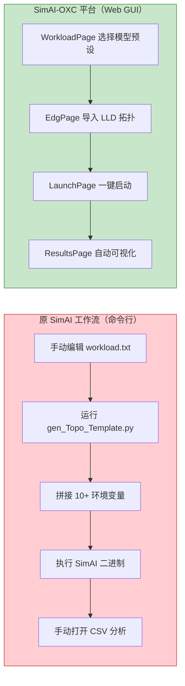

#### 1.2.3 平台设计需求

| 需求编号 | 需求描述 | 优先级 |
|----------|----------|--------|
| REQ-001 | 提供 Web GUI 实现 Workload 参数化生成，支持模型预设和 AIOB GPU 真实计算时间 | P0 |
| REQ-002 | 支持导入真实集群 LLD 数据，通过 EDG 调节自动生成 NS3 拓扑文件 | P0 |
| REQ-003 | 集成 OXC-HCCL 调度算法，GUI 可配置 OXC 服务地址和算法，自动注入 `AS_OXC_ENABLE=1` | P0 |
| REQ-004 | 仿真结果自动解析，提供层级时序分析和维度拆解可视化 | P0 |
| REQ-005 | 多仿真任务管理，NS3 输出按任务前缀重命名防止覆盖，结果页按 prefix 匹配 | P0 |
| REQ-006 | 跨平台可移植（macOS 开发，Linux 生产），无硬编码绝对路径 | P1 |
| REQ-007 | LaunchPage 暴露全部二进制参数（overlap ratio、带宽、GPU/NIC 类型） | P1 |
| REQ-008 | 单 workspace 内禁止并发 NS3 仿真 | P1 |
| REQ-009 | LRA 长时间运行代理协议，强制 feature scope、测试前置、progress.md 时效 | P0 |

### 1.3 架构元素

#### 1.3.1 模块结构

SimAI-OXC 平台采用前后端分离架构，新增代码分布在四个主要区域。下图展示了各区域的职责划分和相互关系：

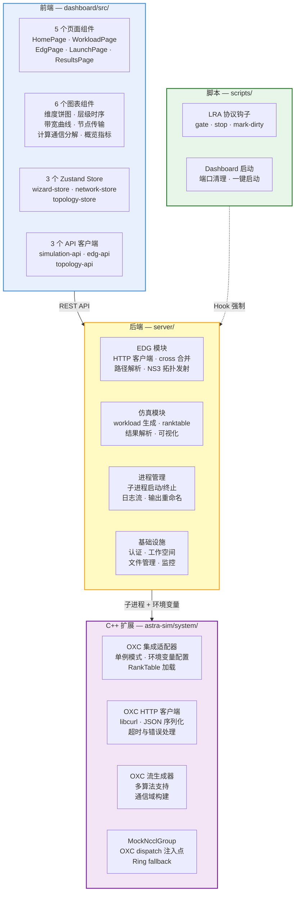

**前端**（React + TypeScript）包含 5 个页面组件，覆盖从工作负载配置到结果分析的完整用户旅程；6 个图表组件基于 Recharts 和 XYFlow 实现多维度可视化；3 个 Zustand store 管理全局状态。

**后端**（Flask + Python）分为四个功能模块：EDG 模块负责与外部 OXC 网络协调器通信并生成 NS3 拓扑；仿真模块处理 workload 生成和结果解析；进程管理模块封装子进程生命周期；基础设施模块提供认证、文件管理和监控能力。

**C++ 扩展**仅修改 astra-sim 仿真引擎中与 OXC 集成相关的 8 个文件。核心是 OXC 集成适配器（单例模式），通过环境变量激活后，在 MockNcclGroup 的 AllReduce 流生成入口处注入 OXC 调度路径。

**脚本层**包含 LRA（长时间运行代理）协议的三个 Hook 脚本，以及 Dashboard 一键启动脚本。

> **说明**：原 SimAI 的 aicb、SimCCL、ns-3-alibabacloud 等核心仿真代码不属于本平台修改范围。

#### 1.3.2 核心状态变量

平台的运行时状态分为前端 Zustand store 和后端 Flask session 两层：

| 变量名 | 类型 | 说明 |
|--------|------|------|
| `wizardStore.launchConfig.collectiveMode` | `'nccl' \| 'oxc-hccl'` | 集合通信模式，决定使用哪个二进制和 OXC 配置 |
| `wizardStore.launchConfig.mode` | `'analytical' \| 'ns3'` | 仿真引擎模式 |
| `wizardStore.launchConfig.tpOverlap` | number | TP overlap ratio [0-1]，控制计算-通信重叠 |
| `wizardStore.workloadConfig.aiob_enable` | boolean | 是否使用 AIOB GPU 真实计算时间 |
| `process_service._log_buffers[pid]` | list | 内存日志缓冲区，PID 对应的最近 500 行 |
| `process_tracker.db.processes` | SQLite 表 | 仿真进程生命周期追踪 |
| `OxcIntegration::OxcAdapter::enabled_` | bool | OXC 是否已启用并成功初始化 |

#### 1.3.3 关键设计组件

1. **EDG 拓扑接入模块**（`server/edg/`）
   - `edg_client.py`：EDG HTTP 客户端，不可达时自动 mock 降级，从 LLD 生成全互联 baseline crosses
   - `merger.py:resolve_paths()`：将 OXC crosses 映射为 leaf-leaf 网络边
   - `merger.py:split_graph_by_pod()`：多 OXC 域场景拆分拓扑为独立 pod 文件
   - `ns3_emitter.py:write_ns3_topology()`：生成 NS3 格式拓扑（节点 ID 分配、NVLink/Leaf 链路、Leaf-Leaf 交叉边）

2. **OXC-HCCL 适配模块**（`OxcIntegration.h/cc`）
   - 单例 `getGlobalOxcAdapter()`，通过 `AS_OXC_ENABLE=1` 激活
   - `fromEnvironment()` 读取 `AS_OXC_URL`、`AS_OXC_ALGO`、`AS_OXC_RANKTABLE` 等环境变量
   - `shouldUseOxc(group_ranks, comm_type)` 判断是否使用 OXC 流替代 ring
   - `generateAllReduceFlows()` 调用 OXC 服务生成优化通信流

3. **进程管理模块**（`process_service.py`）
   - 三 CLI 分支适配：`SimAI_oxc`（OxcMain）、`SimAI_simulator*`（NS3 getopt）、`SimAI_analytical*`（AstraParamParse）
   - `_ensure_local_ns3_config()`：重写 SimAI.conf 路径，`/etc/astra-sim/` → 工作区本地目录
   - `_rename_ns3_outputs()`：仿真完成后 `ncclFlowModel_*` → `{prefix}_*`，防止覆盖
   - NS3 并发防护：同一 workspace 已有 `running` 状态 NS3 进程时拒绝新提交

4. **结果分析模块**（`results_routes.py` + `ResultsPage.tsx`）
   - `_find_ns3_result_files_in_workspace()`：按 prefix 优先匹配 EndToEnd CSV
   - `parse_endtoend_csv()`：解析层级 compute/comm 时间、维度占比
   - 前端 DimensionBreakdown 饼图、LayerTimingChart 甘特图

5. **LRA 长时间运行代理协议**
   - `lra-gate.py`：PreToolUse 钩子，5 规则（in_progress / file scope / dirty / verification_steps / TDD）
   - `lra-stop.py`：Stop 钩子，5 规则 + done 前置条件（test + progress）
   - `lra-mark-dirty.py`：PostToolUse 钩子，标记未测试改动文件
   - `feature_list.json`：active/done/pending_bugs/pending_tests 四段式格式
   - `progress.md`：表格式 session log

6. **Patch 机制**

SimAI-OXC 通过环境变量 `AS_OXC_ENABLE` 控制 OXC 是否接管 NCCL 通信：

- `MockNcclGroup::genAllReduceFlowModels()` → 检测 `shouldUseOxc()` → OXC 路径生成流 / 回退 Ring
- `Sys::generate_collective()` → size=0 拦截 → 返回 inactive DataSet（修复 0 字节 CSV 死锁）
- `process_service.launch()` → 检测 binary 名含 "oxc" → 自动注入 `AS_OXC_ENABLE=1`

其中 `MockNcclGroup.cc:668-704` 是唯一的 OXC dispatch 点，尺寸为 37 行的 inline patch。

---

## 第2章 编码原则与约束

SimAI-OXC 平台遵循以下设计约束：

| 原则 | 约束 |
|------|------|
| **不修改 SimAI 核心仿真代码** | OXC 通过环境变量 + MockNcclGroup dispatch 注入，不修改 NCCL 算法内核 |
| **前后端分离** | React + Flask 通过 REST API 通信，前端通过 Vite proxy 代理后端 |
| **跨平台路径** | 所有路径使用 `__file__` 或 `git rev-parse --show-toplevel` 动态推导，无 `/Users/anthony/` 硬编码 |
| **不可变状态** | 前端 Zustand store 使用 spread operator 不可变更新，`LaunchConfig` 等类型标记 `readonly` |
| **EDG mock 降级** | EDG 服务不可达时自动 mock，不阻塞仿真流程 |
| **进程安全** | NS3 不支持并发写 `ncclFlowModel_*`，启动前检查 DB 中同 workspace 的 NS3 running 状态 |
| **端口复用保护** | `start_dashboard.sh` 启动前 `lsof -ti :$PORT` 杀掉旧进程 |

---

## 第3章 实现模型

### 3.1.1 模块关系总览

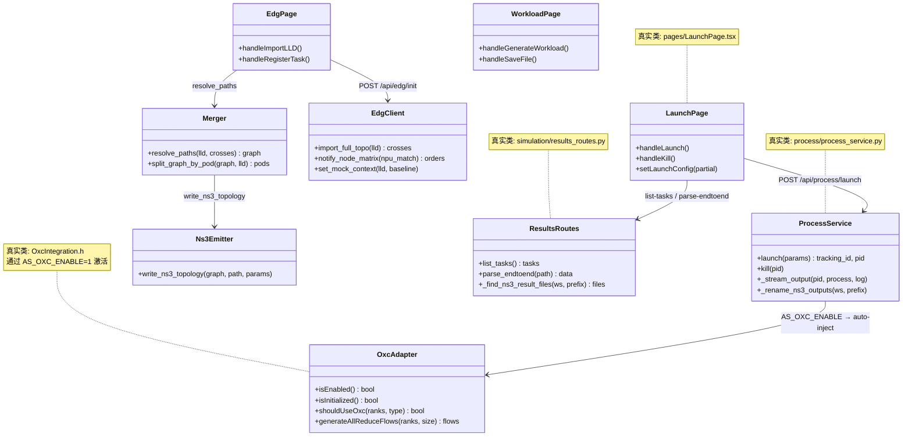

> **说明**：Dashboard 其余页面（HomePage、WorkloadPage）和 C++ 仿真引擎（NS3/Analytical）以 React 组件/子进程形式组织。以下各节按模块逐一描述其函数职责。

### 3.1.2 LaunchPage 组件

**类说明**

`LaunchPage` 是仿真启动配置页面的核心组件，管理集合通信模式选择、OXC 配置、高级参数和仿真生命周期。

| 方法 | 职责 |
|------|------|
| `handleLaunch()` | 构建 extra_args（二进制参数）和 env_vars（环境变量），调用 `launchSimulation()` API；OXC-HCCL 模式自动注入 `AS_OXC_ENABLE=1` |
| `handleKill()` | 通过 `killProcess(pid)` 终止正在运行的仿真 |
| `handleNetworkChange(id)` | 根据所选组网自动填充拓扑路径和 GPU 参数 |
| `setLaunchConfig(partial)` | 不可变更新启动配置 |

### 3.1.3 ProcessService 子进程管理

**状态变量语义**

| 变量 | 类型 | 含义 |
|------|------|------|
| `_log_buffers[pid]` | list[str] | 内存日志缓冲区，PID 对应的最近 500 行 |
| `process_tracker.db.processes.status` | TEXT | 进程状态：running / finished / error / timeout / killed |
| `MAX_PROCESSES_PER_USER` | int | 单用户最大并发进程数 |
| `MAX_TOTAL_PROCESSES` | int | 系统最大总进程数 |

**核心 API 说明**

| 函数 | 说明 |
|------|------|
| `launch(session_token, username, workspace_dir, params)` | 启动仿真子进程；三分支 CLI 适配；返回 (tracking_id, pid) |
| `kill_process(username, pid)` | 终止进程（SIGTERM → SIGKILL 两级） |
| `_stream_output(pid, process, log_path, workspace_dir, output_prefix)` | 守护线程：流式读取 stdout + 写日志 + 完成后重命名输出文件 |
| `_rename_ns3_outputs(workspace_dir, output_prefix)` | `ncclFlowModel_EndToEnd.csv` → `{prefix}_EndToEnd.csv` |
| `_ensure_local_ns3_config(workspace_dir, config_file)` | 生成工作区本地 NS3 配置，重写 `/etc/astra-sim/` 路径 |
| `check_limits(username)` | 检查用户和系统并发限制 |

### 3.1.4 EDG 接入（edg_client.py）

EDG 客户端以 module-level 函数组织。当 EDG 服务不可达时自动降级为 mock 模式。

**核心 API 职责**

| 函数 | 职责 |
|------|------|
| `import_full_topo(lld)` | POST LLD JSON 到 EDG → 返回 `oxc_oper_orders`（baseline crosses） |
| `notify_node_matrix(npu_match)` | POST npu_match → 返回任务调整后的 `oxc_oper_orders` |
| `set_mock_context(lld, baseline_crosses)` | 设置 mock 上下文（多线程场景存在竞态，已知 todo） |
| `_mock_baseline_crosses(lld)` | Mock：从 LLD edges 生成全互联 OXC crosses |
| `_mock_task_adjustment(ctx)` | Mock：拓扑感知的 cross 调整，保证 diff 不为空 |

**设计原则：Mock 降级**

EDG 是外部服务（`http://127.0.0.1:9000/api/port_allocation`），不可达时自动返回 mock 数据，保证仿真流程不阻塞。mock 数据由 LLD 拓扑推导，与真实 EDG 输出格式一致。

### 3.1.5 Merger 拓扑解析（merger.py）

Merger 以 module-level 函数组织，将 OXC crosses 解析为网络连接图。

**核心函数对应关系**

| 函数 | 输入 | 输出 |
|------|------|------|
| `resolve_paths(lld, crosses, participating_server_ips)` | LLD + cross set | connectivity graph |
| `split_graph_by_pod(graph, lld)` | flat graph | `{oxc_ip: sub_graph}` per-ODC domain |
| `apply_batches(base, orders)` | baseline crosses + oper orders | merged cross set |

**多 OXC 域拆分设计要点**

当 LLD 包含多个 OXC 节点时，`split_graph_by_pod()` 按 OXC→leaf→server 关联关系将平坦拓扑拆分为独立 pod 子图：

- leaf 通过 LLD edges 关联到特定 OXC
- server 通过 `server_leaf_edges` 关联到特定 leaf
- 每个 pod 只包含域内的 GPU/NVSwitch/Leaf 节点和链路
- 单 OXC 时返回原图（向后兼容）

### 3.1.6 NS3 拓扑发射器（ns3_emitter.py）

发射器以单一函数形式组织，负责将连接图转换为 NS3 可加载的拓扑文件。

**拓扑文件结构**

NS3 拓扑文件采用纯文本格式。第一行为全局头信息，包含总节点数、每服务器 GPU 数、NVSwitch 数量、Leaf 交换机数量、总链路数和 GPU 类型。第二行列出所有交换机节点的 ID。从第三行起，每行描述一条链路，包含源节点、目标节点、带宽、延迟和错误率五个字段。

**节点 ID 分配规则**

节点 ID 按类型连续分配：GPU 节点占据最低编号段（从 0 开始），NVSwitch 节点紧随其后，Leaf 交换机节点占据最高编号段。这种分配方式使得 NS3 仿真器可以通过简单的数值范围判断节点类型。

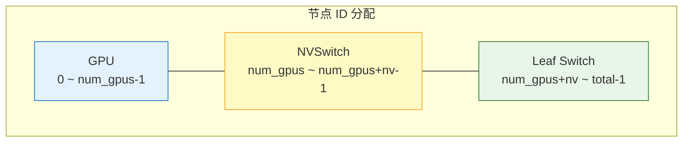

**带宽自动检测**：发射器从 LLD 中 leaf 端口的端口名称字段（如 "400GE/0/1/1"）自动提取带宽值，无需用户手动指定。当端口名称不包含带宽信息时，回退到默认的 100Gbps。

### 3.1.7 模块依赖关系

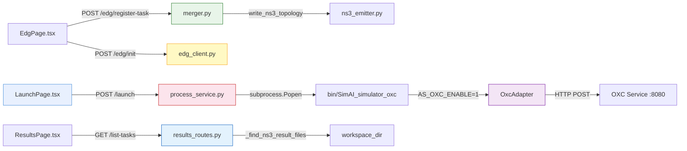

**分层职责**

| 层 | 模块 | 职责 |
|----|------|------|
| 前端展示层 | `dashboard/src/pages/` | 用户交互、表单验证、状态管理 |
| API 路由层 | `server/app.py` + 各蓝图 | REST 端点、认证、参数校验 |
| 业务逻辑层 | `server/simulation/`、`server/edg/` | workload 生成、拓扑发射、结果解析 |
| 进程管理层 | `server/process/process_service.py` | 子进程启动/杀/日志/重命名/并发控制 |
| C++ 仿真层 | `astra-sim-alibabacloud/astra-sim/system/` | OXC 集成、NCCL 模拟、NS3 事件循环 |

---

## 3.2 代码结构模型

### 3.2.1 分层包图

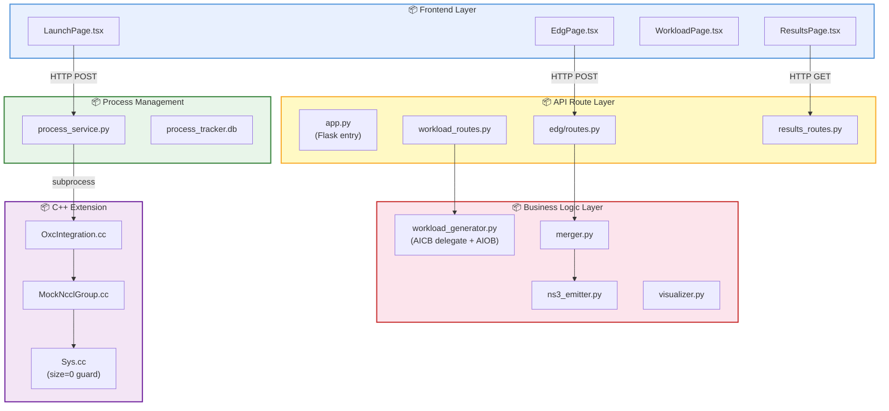

### 3.2.2 模块间调用关系

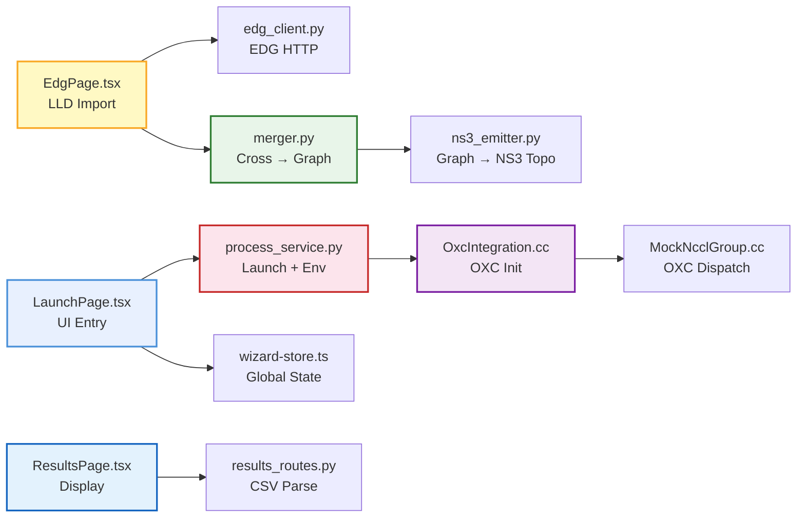

**关键设计原则**：所有跨组件的状态通过 Zustand wizard-store 统一管理（前端）和 SQLite process_tracker.db（后端）持久化。仿真子进程与 Flask 之间通过环境变量传递配置（`AS_OXC_ENABLE`、`AS_OXC_RANKTABLE`），不通过命令行参数。

---

### 3.2.3 设计模式应用

#### 3.2.3.1 Strategy 模式 — 二进制 CLI 适配

**别名**：Policy 模式

**意图**

定义一组二进制命令行接口适配策略，将它们各自封装，使得 Dashboard 可以透明地向用户暴露统一的启动配置，而底层 CLI 差异被隔离。在 process_service 中体现为：`is_oxc` / `is_ns3` / `is_analytical` 三分支。

**结构**

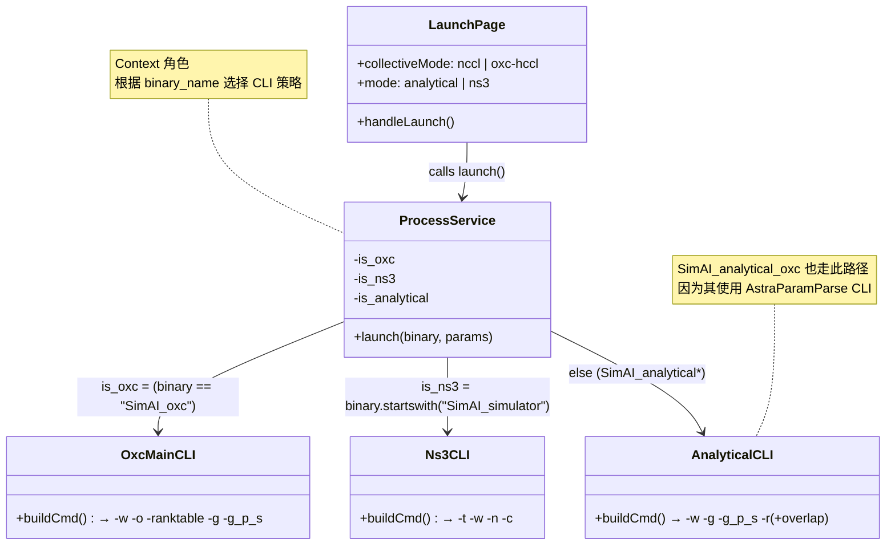

**参与者**

| 角色 | GoF 对应 | 实现 |
|------|----------|------|
| **Strategy（策略接口）** | 隐式接口 | 每种 CLI 的 arg 组装逻辑 |
| **ConcreteStrategy（具体策略）** | 具体 CLI | `OxcMainCLI`：`-o -ranktable`；`Ns3CLI`：`-t -n -c`；`AnalyticalCLI`：`-g -g_p_s -r` |
| **Context（上下文）** | `process_service.launch()` | 根据 `binary_name` 分派 |

**效果**

| 维度 | 评价 |
|------|------|
| **开放-封闭原则** | 新增二进制只需新增一个 `is_*` 分支，不影响已有路径 |
| **运行时透明** | Dashboard 侧仅指定 `collectiveMode + mode`，CLI 差异对用户隐藏 |
| **局限性** | 当前 `launch()` 函数 165 行，三分支嵌套深。未来应重构为每个策略一个独立函数 |

---

## 3.3 领域接口

### 3.3.1 Dashboard 与后端的接口

Dashboard 通过 REST API 与 Flask 后端通信，所有接口要求 session token 认证（`require_auth` 装饰器）。

| 接口 | 方法 | 描述 |
|------|------|------|
| `/api/simulation/workload/generate-preset` | POST | 根据模型预设生成 workload；接受 `aiob_enable`/`comp_filepath` 参数 |
| `/api/simulation/workload/models` | GET | 列出可用模型配置 |
| `/api/edg/init` | POST | 导入 LLD → 生成 baseline crosses |
| `/api/edg/register-task` | POST | npu_match → 合并 crosses → 发射 NS3 topo + ranktable |
| `/api/process/launch` | POST | 启动仿真子进程；返回 pid |
| `/api/process/kill` | POST | 强制终止进程（SIGTERM → SIGKILL） |
| `/api/process/list` | GET | 查询进程列表 |
| `/api/process/logs` | GET | 获取进程实时日志（内存缓冲 + 文件回退） |
| `/api/simulation/results/list-tasks` | GET | 列出已完成任务及其结果文件 |
| `/api/simulation/results/parse-endtoend` | POST | 解析 EndToEnd CSV 内容 |
| `/api/files/save` | POST | 保存文件到工作区 |
| `/api/files/load` | GET | 从工作区加载文件 |

### 3.3.2 模块间接口调用

| 步骤 | 模块 | 职责 |
|------|------|------|
| 1 | `WorkloadPage.tsx` | 用户配置模型、并行策略、AIOB 开关 |
| 2 | `workload_routes.py` | 接收参数，调用 `generate_megatron_workload()` |
| 3 | `workload_generator.py` | 委托 AICB `SIMAI_workload`；AIOB 启用时调用 `workload_generate_aiob()` |
| 4 | `EdgPage.tsx` | 导入 LLD JSON，触发 EDG init + register-task |
| 5 | `edg_client.py` → `merger.py` → `ns3_emitter.py` | 生成 NS3 拓扑文件和 ranktable |
| 6 | `LaunchPage.tsx` | 选择模式、配置参数、`handleLaunch()` |
| 7 | `process_service.launch()` | CLI 适配 → subprocess.Popen → 守护线程流式读 stdout |
| 8 | `Workload.cc` (C++) | 解析 workload → 逐层 compute + Blocking/NonBlocking comm |
| 9 | `MockNcclGroup.cc` (C++) | shouldUseOxc → OXC 流 / Ring 流 |
| 10 | `_stream_output` → `_rename_ns3_outputs` | 重命名 ncclFlowModel_* → {prefix}_* |
| 11 | `ResultsPage.tsx` → `results_routes.py` | list-tasks → 匹配 prefix → parse → 可视化 |

---

> **3.4 数据模型** — 仿真运行时数据不持久化；进程追踪使用 3.1.3 节的 SQLite `processes` 表；EndToEnd CSV 为 3.1.6 节的格式。
>
> **3.5 安全实现模型** — 见第 6.2 节安全设计。
>
> **3.7 构建模型** — 构建系统属于原 SimAI（`scripts/build.sh`、`astra-sim-alibabacloud/build.sh`），本平台不涉及构建系统修改（仅修复了符号链接 `ln -s` → `ln -sfr` 跨平台兼容）。

---

## 3.6 算法实现模型

### 3.6.1 LLD → EDG → NS3 拓扑三级转换算法

**算法目标**

将真实集群的 LLD（链路层发现）数据转换为 NS3 仿真器可加载的拓扑文件。核心挑战是 LLD 包含 OXC 节点和端口级连接关系，NS3 拓扑需要简化为 GPU/NVSwitch/Leaf 三层节点模型。

**算法描述**

拓扑转换分为五个阶段。首先，将 LLD JSON 发送到 EDG 服务（或 mock 降级），获取基线 OXC 交叉连接列表。然后，将训练任务的 NPU 匹配信息发送到 EDG，获取任务调整后的交叉连接操作指令，并与基线合并。第三步，路径解析器将合并后的 OXC crosses 映射为 leaf-to-leaf 的网络边，同时过滤出参与训练的服务器子集。第四步，如果 LLD 包含多个 OXC 节点，按 OXC 域拆分为独立的 pod 子图。最后，为每个 pod 生成 NS3 拓扑文件，按照 GPU → NVSwitch → Leaf 的三层节点模型分配 ID，并生成三类链路：GPU 到 NVSwitch 的 NVLink 高速链路（2400Gbps）、GPU 到 Leaf 的 NIC 链路（400Gbps）、以及 Leaf 到 Leaf 的 OXC 交叉链路。

下图展示了整个转换流水线：

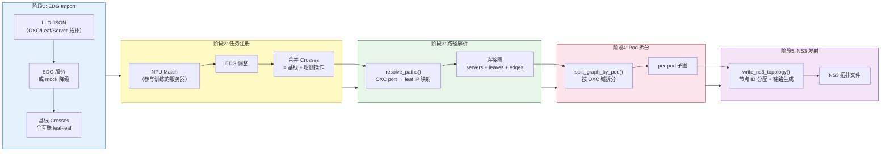

**数据流示意图**

以 1 OXC × 4 Leaf × 4 Server（8 GPU/server）为例：

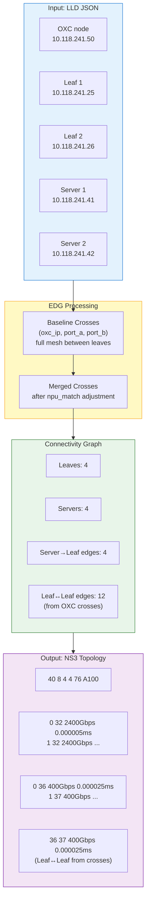

**复杂度分析**

以 1 OXC × 4 Leaf 为例：

| 阶段 | 操作 | 复杂度 |
|------|------|--------|
| EDG Import | 全互联生成 | O(L²) ，L=leaf 数 |
| Path Resolution | OXC port → leaf IP 映射 | O(P) ，P=cross 数 |
| Topology Emission | 节点迭代 | O(N+G+L)，总数 |
| 总节点数 | 4×8 GPU + 4 NVSwitch + 4 Leaf = 40 | — |
| 总链路数 | 32 NVLink + 32 NIC + 12 Leaf-Leaf = 76 | — |

### 3.6.2 OXC-HCCL AllReduce 替换算法

**算法目标**

将默认 Ring AllReduce（O(n) 步串行）替换为 OXC 光学交叉连接调度的优化通信流。OXC 服务接收 group_ranks + data_size 的 HTTP 请求，返回 `SingleFlow` map。

**算法描述**

OXC AllReduce 替换采用"尝试 OXC → 多级 fallback → Ring 兜底"的策略。当仿真引擎需要为某个通信组生成 AllReduce 流时，首先检查 OXC 适配器是否已启用且初始化成功。如果未启用，直接走标准 Ring 算法。如果已启用，进一步判断该通信组是否跨 Rack——机内通信（intra-rack）走 NVLink 已经足够快，OXC 的优势体现在跨机架的光学交换上，因此仅对跨 Rack 的通信组调用 OXC 服务。

OXC 服务通过 HTTP POST 接收通信组的 rank 列表和数据量，返回优化后的流调度方案。如果 HTTP 请求超时、连接失败或返回空结果，均自动回退到 Ring 算法，确保仿真不会因外部服务异常而中断。成功获取 OXC 流后，按照源/目标 rank 将流分配到各 rank 的 FlowModel 中，供 NS3 事件循环驱动。

**OXC fallback 决策树**

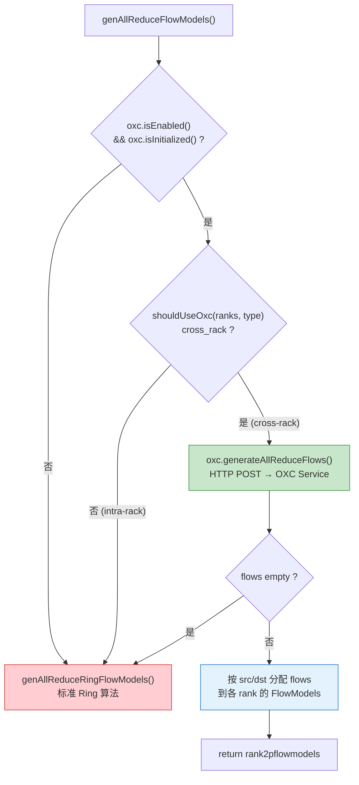

**关键约束**

| 条件 | OXC 行为 | 理由 |
|------|----------|------|
| `cross_rack = false` (intra-server) | 回退 Ring | 机内 NVLink 足够快，OXC 优势在跨机 |
| `cross_rack = true` | 调用 OXC | OXC 光学交换机优化跨机通信 |
| HTTP 超时 / 连接失败 | 回退 Ring | 不阻塞仿真 |
| OXC 返回空 flows | 回退 Ring | OXC 无法生成有效流 |

### 3.6.3 Sys::generate_collective size=0 防护算法

**算法目标**

防止 `size=0` 的 collective 调用产生 0/0=NaN 导致 DataSet 永久 active 死锁。这是 EndToEnd.csv 0 字节的根因修复。

**算法描述**

在仿真引擎的集合通信入口处增加了零字节防护。当 workload 中某一层的通信数据量为零时（例如输入梯度阶段的 ReduceScatter），原代码会用零去计算分块大小，导致除零产生 NaN，进而使 DataSet 对象永远处于 active 状态，阻塞整个仿真流水线，最终表现为 EndToEnd.csv 文件为 0 字节。

修复方案是在入口处检测 size 是否为零。如果为零，立即创建一个空的 DataSet 并将其标记为 inactive，使调用方跳过该通信操作。这是一个典型的 Fail Fast 防护，将故障从"静默死锁"转变为"安全跳过"。

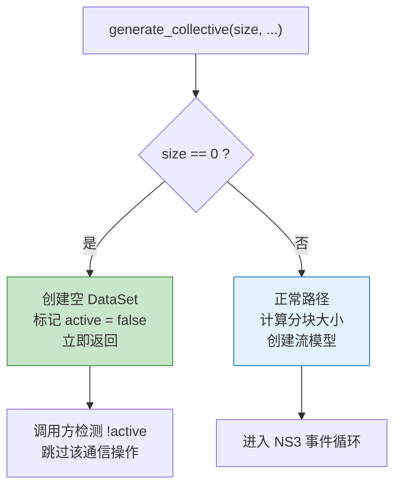

**修复前后对比**

| 场景 | 修复前 | 修复后 |
|------|--------|--------|
| `size=0` REDUCESCATTER | chunk_size=0, streams=NaN (0/0), DataSet 永久 active → deadlock | 返回 active=false 空 DataSet → 调用方 `!ig->active` 路径跳过 |
| EndToEnd.csv | 0 字节 | 正常写入 |

### 3.6.4 ns3_emitter 拓扑文件生成算法

**算法目标**

将 connectivity graph 转换为 NS3 仿真器可解析的拓扑文件格式。单文件最大支持约 10K 节点。

**算法描述**

拓扑文件生成器接收连接图（包含服务器列表、叶子交换机列表和 leaf-leaf 边列表），将其转换为 NS3 仿真器可解析的拓扑文件。单文件最大支持约 10K 节点。

生成过程分为三步。首先，根据服务器数量和每服务器 GPU 数计算总节点数，按 GPU → NVSwitch → Leaf 的顺序分配连续的节点 ID。然后，为每台服务器生成两类链路：GPU 到 NVSwitch 的 NVLink 高速链路（默认 2400Gbps，延迟 0.000005ms）和 GPU 到所属 Leaf 的 NIC 链路（默认 400Gbps，延迟 0.000025ms），其中 NIC 链路采用 rail-optimized 布局，即每个 GPU 连接到其所属服务器对应的 Leaf 交换机。最后，根据连接图中的 leaf-leaf 边生成 OXC 交叉链路。

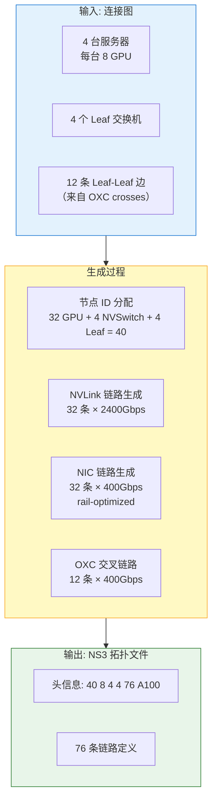

**设计决策**

| 决策 | 选择 | 理由 |
|------|------|------|
| NVSwitch 节点数 | `servers × nv_per_server` | 默认 1，未来可扩展 |
| Leaf 交换机节点 | 仅叶子，不含 OXC | OXC 在 NS3 层不建模为交换机 |
| 自动带宽检测 | LLD port_name → 带宽 | 如 `400GE/0/1/1` → `400Gbps` |
| Rail-optimized | GPU 连所属 server 的 leaf | 模拟物理布线 |

### 3.6.5 _rename_ns3_outputs 防覆盖算法

**算法目标**

NS3 二进制硬编码 `RESULT_PATH="./ncclFlowModel_"`，两并发仿真必然互相覆盖。算法在仿真完成后的 `_stream_output.finally` 中重命名输出文件。

**算法描述**

NS3 仿真二进制将输出文件名硬编码为以 "ncclFlowModel_" 为前缀（如 ncclFlowModel_EndToEnd.csv、ncclFlowModel_detailed_9.csv 等）。如果两个仿真任务先后运行在同一工作区，后者的输出会覆盖前者。

防覆盖机制分为两层。第一层是**启动前互斥**：在启动 NS3 仿真前，查询数据库中同一工作区是否已有处于 running 状态的 NS3 进程，如果有则拒绝新提交并返回错误提示。第二层是**完成后重命名**：仿真子进程退出后，守护线程遍历工作区中所有以 "ncclFlowModel_" 开头的文件，将前缀替换为任务特定的标识符（如 "GPT-7B-tp8-dp4"），确保每个任务的输出文件名唯一。重命名发生在进程退出之后、状态更新之前，保证时序正确。

结果页在查找任务对应的 CSV 文件时，按前缀优先级排序：精确匹配优先，通用匹配次之，无匹配则跳过。

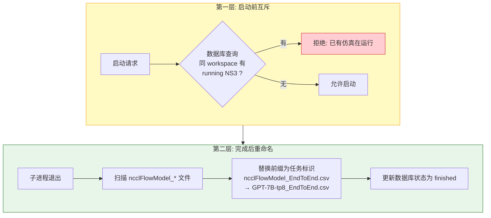

**设计要点**

| 要点 | 说明 |
|------|------|
| 重命名时机 | `process.wait()` 后，`update_status()` 前 |
| 前缀来源 | 优先从 extra_args 中 `-r` 提取，否则 fallback 到 `sim_result_{ts}` |
| 结果匹配 | `_find_ns3_result_files_in_workspace(prefix)` 按 prefix 优先级排序 (exact match → generic → skip) |

---

## 第4章 运行视图设计

### 4.1.1 Dashboard 向导全过程时序图

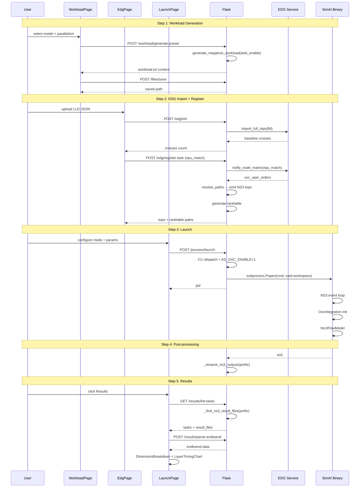

### 4.1.2 OXC 集成初始化时序图

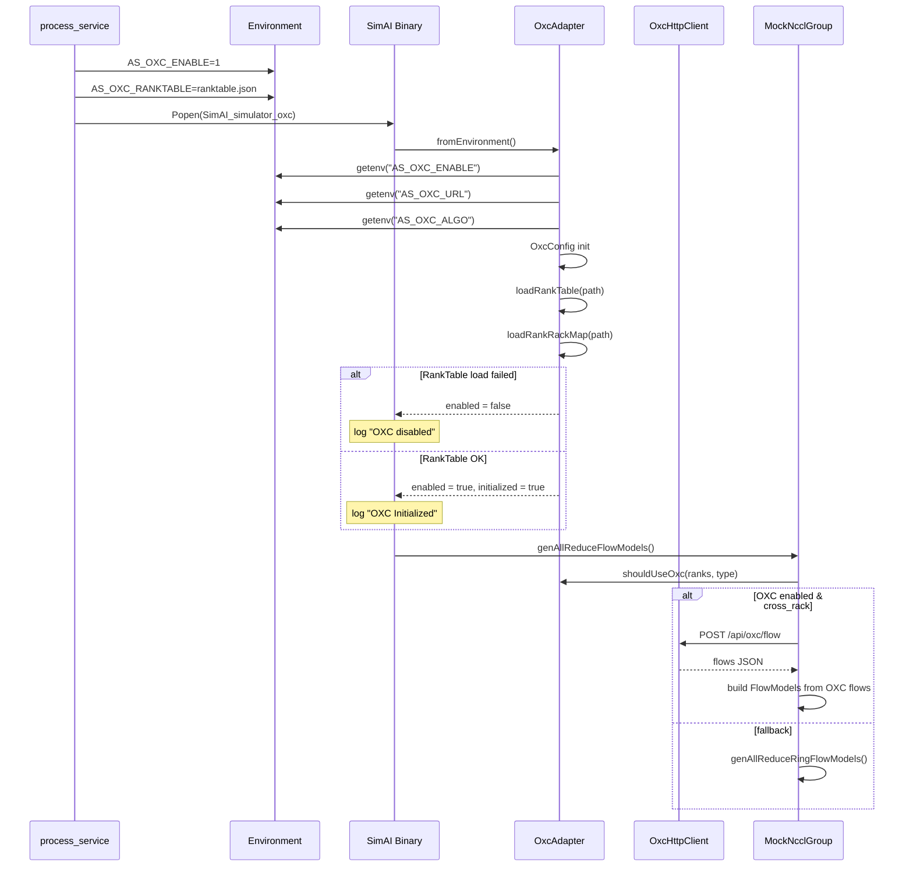

### 4.1.3 NS3 仿真结果写入流程时序图

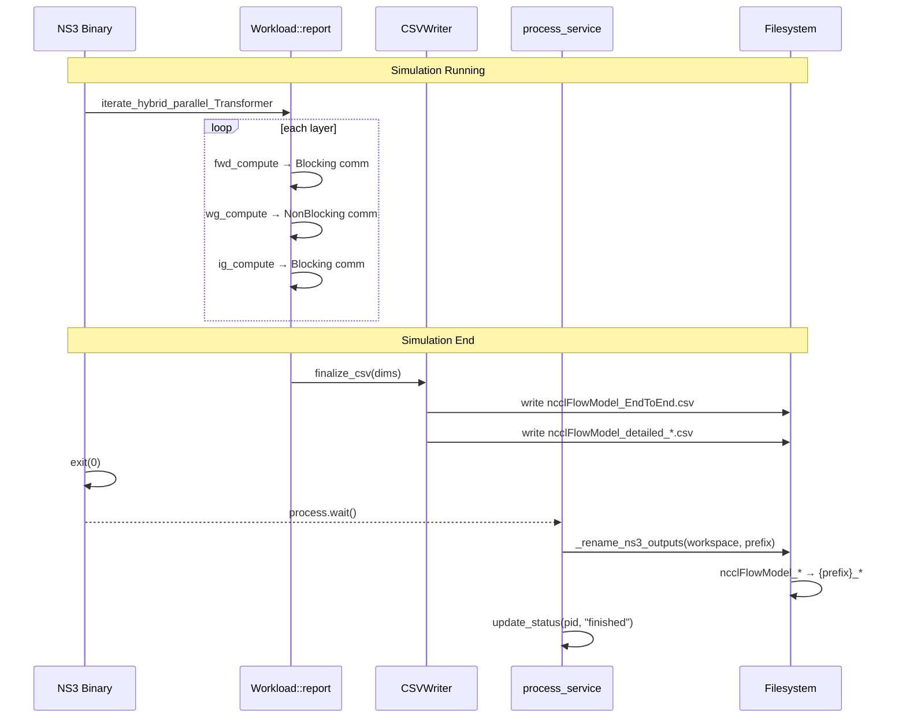

### 4.1.4 多仿真结果不覆盖时序图

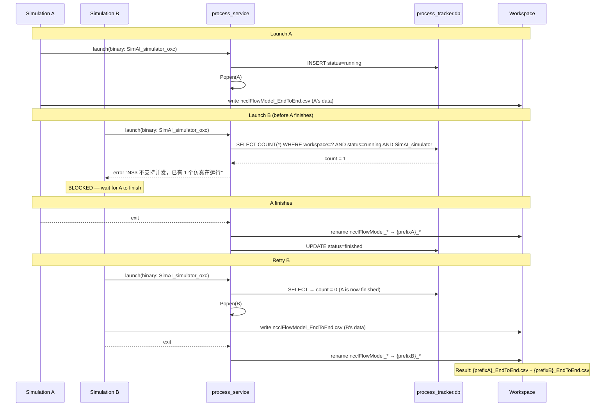

---

## 4.2 并发模型 —— 进程隔离 + DB 互斥

SimAI-OXC 采用 **进程级隔离 + DB 状态互斥**架构。每个仿真以独立子进程运行，与 Flask 主进程通过守护线程（`_stream_output`）监控。NS3 因硬编码输出文件名，通过启动前 DB 查询实现互斥。

### 4.2.1 进程-线程并发拓扑

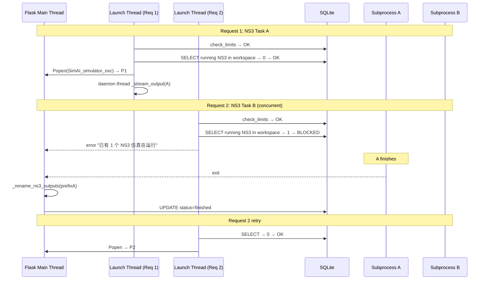

### 4.2.2 非 NS3 并发

NS3 的互斥仅因硬编码文件名。Analytical 和 OXC 二进制不共享输出文件，无此限制——仍受 `MAX_PROCESSES_PER_USER` 和 `MAX_TOTAL_PROCESSES` 全局约束。

### 4.2.3 设计总结

| 维度 | 设计选择 | 理由 |
|------|----------|------|
| 进程隔离 | `subprocess.Popen` 独立子进程 | 仿真 crash 不影响 Flask |
| 日志流式读取 | 守护线程 `iter(process.stdout.readline)` | 实时显示日志 |
| NS3 互斥 | DB `SELECT WHERE status=running` 启前检查 | 防止 ncclFlowModel_* 被覆盖 |
| 超时 | `params.timeout > 0` 时启用 watchdog 守护线程 | 默认 0（无超时），用户可选 |
| 端口复用 | `lsof -ti :PORT | xargs kill` | 非 NS3 重启时自动清理 |

---

> **第5章 DT 测试设计** — 本平台测试由 LRA 协议强制驱动。每次代码变更后运行 `scripts/lra-test.sh`（tsc + pytest + Playwright E2E）。测试策略详见 feature_list.json 中各条目的 `verification_steps`，以及 `scripts/lra-gate.py` 的 Rule 4/5 TDD 强制执行。

---

## 第6章 DFX 设计

平台作为仿真工具的前端交互层，其可靠性直接影响研究者的工作效率和数据正确性。

### 6.1 可靠性分析

#### 6.1.1 FMEA 分析总表

| 编号 | 功能步骤 | 故障模式 | 故障影响 | 严重度 | 故障原因 | 改进措施 | 当前状态 |
|------|----------|----------|----------|--------|----------|----------|----------|
| F01 | `process_service.launch()` | CLI 分支误匹配 | 二进制打印 help 退出 | 高 | `is_oxc` 包含 `SimAI_analytical_oxc`，但该二进制用 AstraParamParse CLI | 修 `is_oxc = (binary_name == "SimAI_oxc")`；analytical_oxc 走 analytical 分支 | 已修复 |
| F02 | `Sys::generate_collective()` | `size=0` 产生 0/0=NaN | DataSet 永久 active，死锁，CSV 0 字节 | 致命 | workload 中输入梯度 size=0 的 REDUCESCATTER | 入口加 `size==0 → return active=false 空 DataSet` | 已修复 |
| F03 | `_stream_output` | 管道缓冲区满 | 子进程阻塞在 stdout 写入 | 中 | 仿真输出速度 > Python readline 速度 | 端口 `bufsize=1` 行缓冲 + 内存 500 行限制 | 已缓解 |
| F04 | EDG mock | mock context 全局变量并发覆盖 | 两个线程的 mock 数据交叉污染 | 中 | `_mock_ctx` 模块级全局变量 | 当前 EDG 仅 mock 模式，无实际并发。待改为 threading.local() | 已知待修 |
| F05 | NS3 输出覆盖 | 同 workspace 两个 NS3 并发 | 第二个仿真覆盖第一个的输出文件 | 致命 | NS3 硬编码 `ncclFlowModel_` 输出前缀 | 启动前 DB 检查 + 完成后 `_rename_ns3_outputs()` | 已修复 |
| F06 | Flask reload | 旧 Flask 进程未杀透 | 新代码不生效，用户困惑 | 高 | `start_dashboard.sh` 无启动前端口检查 | `lsof -ti :$PORT \| xargs kill` 杀掉旧进程 | 已修复 |
| F07 | AIOB compute_time=1 | `compute_cache=None` 导致全 workload 占位值 | 仿真无真实计算时间 | 中 | `generate_workload_content()` 传 `None` 给 `SIMAI_workload` | 加载 `extract_averages()` 并调用 `workload_generate_aiob()` | 已修复 |
| F08 | 结果页 prefix 不匹配 | `_extract_result_prefix` 取首个 `-r` | 任务找不到自己的 CSV | 中 | `re.search` 只取第一个匹配 | 改为 `re.findall` 取最后一个 | 已修复 |
| F09 | progress.md 时效 | 无 in_progress feature 时 Rule 5 不触发 | progress 更新被遗漏 | 低 | Rule 5 仅在 in_progress 时检查 | 已加独立 done 前置条件 Rule 3b | 已修复 |
| F10 | LRA gate bypass | Bash/sed 修改文件不被 gate 拦截 | 绕过 feature scope 检查 | 中 | PreToolUse matcher 仅匹配 Edit/Write | 已加 Bash matcher + `_is_modifying_bash()` 命令检测 | 已修复（需重载 Claude Code） |
| F11 | 旧 Flask 残存 | `pkill -f python.*server` 不匹配 `Python -m server.app` | 旧代码持续运行数小时 | 中 | 进程命令行大小写差异 | `start_dashboard.sh` 改为 `lsof -ti :$PORT` 按端口杀 | 已修复 |
| F12 | 数据库记录残留 | processes 表不清 | 结果页显示历史 stale 数据 | 低 | 无自动清理 | 手动 `DELETE FROM processes` | 可接受 |

#### 6.1.2 故障严重度分级

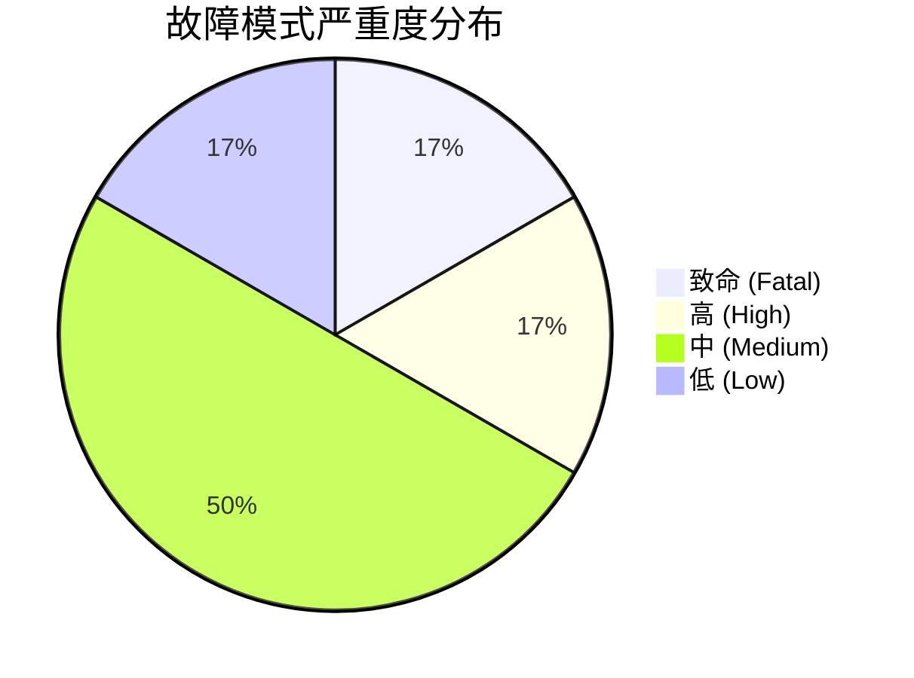

**致命故障**（仿真无法完成或数据全部丢失）：F02、F05
**高影响故障**（仿真完成但结果错误或流程中断）：F01、F06
**中影响故障**（功能退化或用户体验下降）：F03、F04、F07、F08、F10、F11

#### 6.1.3 可靠性改进措施设计

**改进措施 1：size=0 集合通信防护**

| 项目 | 内容 |
|------|------|
| 对应故障 | F02（致命） |
| 实现思路 | 在 Sys::generate_collective() 入口处检测数据量是否为零。零字节的集合通信操作会导致分块计算产生除零异常，使 DataSet 永久处于 active 状态，阻塞整个仿真流水线 |
| 功能点 | 检测到 size=0 时，立即创建一个空的 DataSet 并标记为 inactive，使调用方通过 !active 条件跳过该操作 |
| 效果 | 将"静默死锁导致 CSV 0 字节"转变为"安全跳过零字节操作" |

**改进措施 2：NS3 输出文件防覆盖**

| 项目 | 内容 |
|------|------|
| 对应故障 | F05（致命） |
| 实现思路 | 两层防护：启动前通过数据库查询同一工作区是否已有运行中的 NS3 进程（互斥锁）；仿真完成后将硬编码前缀 ncclFlowModel_ 重命名为任务特定前缀 |
| 功能点 | 启动前 DB 互斥检查 + 完成后 _rename_ns3_outputs() 重命名 |
| 效果 | 确保每个仿真任务的输出文件名唯一，结果页可按前缀精确匹配 |

**改进措施 3：CLI 三分支适配**

| 项目 | 内容 |
|------|------|
| 对应故障 | F01（高） |
| 实现思路 | SimAI 有三种二进制，各自使用不同的命令行接口。process_service 根据二进制名称精确匹配（而非包含匹配），将 SimAI_oxc 路由到 OxcMain CLI，SimAI_simulator* 路由到 NS3 getopt CLI，其余路由到 AstraParamParse CLI |
| 功能点 | is_oxc 判断从 "oxc" in name 改为 name == "SimAI_oxc"，避免 SimAI_analytical_oxc 误匹配 |
| 效果 | 消除 CLI 参数不匹配导致的二进制 help 退出 |

**改进措施 4：EDG mock 降级**

| 项目 | 内容 |
|------|------|
| 对应故障 | F04（中） |
| 实现思路 | EDG 是外部服务，不可达时自动返回 mock 数据。mock 数据从 LLD 拓扑推导，格式与真实 EDG 输出一致，保证仿真流程不阻塞 |
| 功能点 | HTTP 请求异常时捕获 RequestException，返回 mock 响应并附带 _warning 字段提示用户 |
| 效果 | EDG 服务不可用时平台仍可正常运行，用户通过 warning 标识知晓当前为降级模式 |

**改进措施 5：端口复用保护**

| 项目 | 内容 |
|------|------|
| 对应故障 | F06（高）、F11（中） |
| 实现思路 | Dashboard 启动脚本在启动前按端口号查找并终止旧进程，而非按进程名匹配（避免大小写差异导致漏杀） |
| 功能点 | 使用 lsof 按端口查找进程 PID，确保新启动的 Flask 和 Vite 服务能正常绑定端口 |
| 效果 | 消除"旧 Flask 残存导致新代码不生效"的问题 |

**改进措施 6：AIOB 计算时间注入**

| 项目 | 内容 |
|------|------|
| 对应故障 | F07（中） |
| 实现思路 | workload 生成时，如果用户启用了 AIOB（AI Operator Benchmark），从 GPU 计算时间文件中提取每层的平均计算耗时，注入到 workload 文件中替代默认占位值 1 |
| 功能点 | 加载 extract_averages() 解析 GPU timing 文件，调用 workload_generate_aiob() 生成带真实计算时间的 workload |
| 效果 | 仿真结果中的计算时间反映真实 GPU 性能，而非全部为占位值 |

#### 6.1.4 可靠性设计要点总结

| 设计原则 | 代码体现 |
|----------|----------|
| **Fail Fast** | Sys::generate_collective() 入口 size=0 立即返回；process_service 启动前校验二进制存在性和文件有效性 |
| **Graceful Degradation** | EDG 不可达时自动 mock 降级；OXC HTTP 超时时回退 Ring 算法；RankTable 加载失败时禁用 OXC |
| **Idempotent Output** | _rename_ns3_outputs() 确保每个仿真的输出文件名唯一；结果页按前缀优先级匹配 |
| **Concurrency Safety** | NS3 启动前 DB 互斥检查；MAX_PROCESSES_PER_USER 全局并发限制 |
| **Defensive Validation** | 三分支 CLI 精确匹配；文件路径遍历防护；二进制名称白名单 |

```mermaid
flowchart TD
    subgraph Principles["可靠性设计原则"]
        FF["Fail Fast<br/>size=0 防护<br/>启动前校验"]
        GD["Graceful Degradation<br/>EDG mock · OXC fallback<br/>RankTable 失败禁用"]
        IO["Idempotent Output<br/>文件重命名<br/>前缀匹配"]
        CS["Concurrency Safety<br/>DB 互斥<br/>并发限制"]
        DV["Defensive Validation<br/>CLI 精确匹配<br/>路径校验 · 白名单"]
    end

    FF --> F02["F02 致命: size=0 死锁"]
    GD --> F04["F04 中: EDG 不可达"]
    IO --> F05["F05 致命: 输出覆盖"]
    CS --> F05
    DV --> F01["F01 高: CLI 误匹配"]

    style Principles fill:#E8F5E9,stroke:#2E7D32,stroke-width:2px
    style F02 fill:#FFCDD2,stroke:#D32F2F
    style F05 fill:#FFCDD2,stroke:#D32F2F
    style F04 fill:#FFF9C4,stroke:#F9A825
    style F01 fill:#FFF9C4,stroke:#F9A825
```

---

### 6.2 安全设计

#### 6.2.1 安全威胁模型

```mermaid
flowchart TB
    subgraph TrustBoundary["信任边界"]
        direction TB
        TB1["Dashboard 内网<br/>（受信）"]
        TB2["外部<br/>（非受信）"]
    end

    subgraph Surface["攻击面"]
        A["文件上传<br/>LLD JSON"]
        B["Workload 参数<br/>tp_size etc."]
        C["环境变量<br/>AS_OXC_URL"]
        D["子进程命令<br/>extra_args"]
        E["SQLite 查询<br/>文件路径"]
    end

    TB2 --> A
    TB2 --> B
    TB2 --> C
    TB1 --> D
    TB1 --> E

    style TrustBoundary fill:#FFCDD2,stroke:#D32F2F
    style Surface fill:#FFF9C4,stroke:#F9A825
```

#### 6.2.2 安全配置项分析

| 编号 | 安全项 | 风险等级 | 风险描述 | 缓解措施 | 状态 |
|------|--------|----------|----------|----------|------|
| S01 | 文件保存路径遍历 | 中 | `save_file` 中 filename 可为 `../../etc/passwd` | `_validate_filename` 拒绝 `/` 和 `..` | 已缓解 |
| S02 | 子进程命令注入 | 中 | `extra_args` 来自用户输入，传入 `subprocess.Popen` | CLI 白名单过滤（`is_oxc` 分支丢弃未知 flags） | 已缓解 |
| S03 | 环境变量注入 | 低 | `AS_OXC_URL` 指向恶意 OXC 服务 | OXC 仅在受控集群内运行，URL 由管理员配置 | 可接受 |
| S04 | SQLite 注入 | 低 | `workspace_dir` 传入 SQL | 使用参数化查询 `(workspace_dir,)` | 已缓解 |
| S05 | Session token 泄露 | 低 | token 在日志 URL 中暴露 | 仅本地开发环境，生产可配 HTTPS | 可接受 |
| S06 | 硬编码 SECRET_KEY | 中 | `config.py` 默认 `simai-dev-key-change-in-production` | 生产环境通过 `SIMAI_SECRET_KEY` 环境变量覆盖 | 可接受 |
| S07 | Flask debug 模式 | 低 | 代码中硬编码 `debug=False`，但无环境变量二次保护 | 添加 `FLASK_ENV` 检查 | 可接受 |
| S08 | 密码哈希无盐 | 中 | `hashlib.sha256(password)` 无盐 | 改为 PBKDF2（当前使用 YAML 配置 auth，开发环境） | 待修 |

#### 6.2.3 安全设计确认清单

| 检查项 | 结果 | 说明 |
|--------|------|------|
| 无硬编码凭据 | 通过 | 代码中无 API key、密码、token 硬编码 |
| 路径遍历防护 | 通过 | `_validate_filename()` 拒绝 `..` 和 `/` |
| SQL 注入防护 | 通过 | 全部使用参数化查询 |
| 命令注入防护 | 通过 | 二进制名称白名单（`ALLOWED_BINARIES`） |
| 网络暴露面 | 通过 | Dashboard 仅监听 localhost |
| 异常处理信息泄露 | 通过 | 错误信息返回给前端，不包含系统路径 |

#### 6.2.4 OXC 环境变量注入安全分析

SimAI-OXC 通过环境变量将 OXC 配置从 Dashboard 传递到 C++ 仿真二进制。这一机制是平台最关键的安全关注点之一，因为环境变量在进程启动后不可变，但其值来源于前端用户输入。

以下是注入链路的完整分析：

```mermaid
sequenceDiagram
    participant UI as LaunchPage (前端)
    participant FL as Flask (后端)
    participant ENV as 环境变量
    participant BIN as SimAI Binary (C++)
    participant OXC as OxcAdapter

    Note over UI,OXC: 注入阶段（仅启动时执行一次）

    UI->>FL: POST /process/launch<br/>{oxcUrl, oxcAlgo, ranktablePath}
    FL->>FL: 白名单校验 binary_name
    FL->>FL: 路径校验 ranktable 文件存在性
    FL->>ENV: AS_OXC_ENABLE=1
    FL->>ENV: AS_OXC_URL=用户指定值
    FL->>ENV: AS_OXC_ALGO=用户指定值
    FL->>ENV: AS_OXC_RANKTABLE=工作区内路径
    FL->>BIN: subprocess.Popen(cmd, env=env)

    Note over BIN,OXC: 运行时（环境变量已固定）

    BIN->>OXC: fromEnvironment()
    OXC->>ENV: getenv("AS_OXC_URL")
    OXC->>OXC: initialize(config)
    Note over OXC: URL 仅用于 HTTP POST<br/>不执行 shell 命令
```

**安全保障**：

| 保障维度 | 措施 |
|----------|------|
| 输入可控 | AS_OXC_URL 仅用于 libcurl HTTP POST，不传入 shell 或 system() |
| 路径限制 | AS_OXC_RANKTABLE 路径经过后端校验，必须位于工作区目录内 |
| 时机可控 | 环境变量在 Popen 时一次性设置，运行时不可修改 |
| 算法名称 | AS_OXC_ALGO 仅作为 JSON 字段传递给 OXC 服务，不影响本地执行逻辑 |
| 进程隔离 | 每个仿真子进程拥有独立的环境变量副本，互不影响 |

#### 6.2.5 RankTable 与 LLD JSON 文件安全分析

平台接受两类外部 JSON 文件输入：RankTable（GPU 拓扑描述）和 LLD（链路层发现数据）。两者均由用户上传或由管理员预置。

| 维度 | RankTable | LLD |
|------|-----------|-----|
| 解析方式 | C++ 手动 JSON 解析（无第三方库） | Python json.load（标准库） |
| 路径来源 | AS_OXC_RANKTABLE 环境变量 | 前端上传 → 后端 save_file → edg_client |
| 内容使用 | 构建 OXC API 请求体 | 构建连接图 → 生成 NS3 拓扑 |
| 大小限制 | 无显式限制（建议 < 10MB） | 无显式限制（建议 < 10MB） |
| 残留风险 | 超大 rank_list 可能导致内存耗尽 | 深度嵌套 JSON 可能导致解析栈溢出 |
| 缓解措施 | C++ 解析器逐字段读取，不递归 | Python json.load 有默认递归深度限制 |

#### 6.2.6 Workspace 隔离分析

每个用户登录后获得独立的工作区目录。所有文件操作（workload 保存、拓扑生成、结果输出）均限制在工作区内。

```mermaid
flowchart TB
    subgraph WS_A["Workspace A (用户 alice)"]
        WA_WL["workload_a.txt"]
        WA_TOPO["edg_topo_T001"]
        WA_RES["GPT-7B_EndToEnd.csv"]
    end

    subgraph WS_B["Workspace B (用户 bob)"]
        WB_WL["workload_b.txt"]
        WB_TOPO["edg_topo_T002"]
        WB_RES["LLaMA-13B_EndToEnd.csv"]
    end

    subgraph Guards["隔离保障"]
        G1["require_auth 装饰器<br/>每个请求绑定 workspace_dir"]
        G2["_validate_filename<br/>拒绝 .. 和 / 路径遍历"]
        G3["子进程 cwd=workspace_dir<br/>输出文件限制在工作区内"]
    end

    Guards --> WS_A
    Guards --> WS_B

    style WS_A fill:#E3F2FD,stroke:#1976D2
    style WS_B fill:#FFF9C4,stroke:#F9A825
    style Guards fill:#E8F5E9,stroke:#2E7D32
```

**隔离保证**：
- 不同用户的工作区目录物理隔离，无共享文件
- 认证中间件在每个请求中注入 workspace_dir，后续所有文件操作以此为根目录
- 子进程的 cwd 设置为工作区目录，NS3 输出文件自然落入工作区内
- 唯一的跨工作区共享资源是 SQLite 数据库（进程追踪），但查询时按 workspace_dir 过滤

#### 6.2.7 残余风险与建议

| 风险 | 等级 | 建议 |
|------|------|------|
| LLD JSON 炸弹（深度嵌套导致内存耗尽） | 低 | 在 edg_client 入口对文件大小做上限检查（建议 10MB） |
| mock context 全局变量竞态 | 中 | 将 _mock_ctx 改为 threading.local()，或在 EDG 真实部署后移除 mock |
| 密码哈希无盐 | 中 | 当前为开发环境 YAML 配置认证，生产部署前应改为 PBKDF2 或 bcrypt |
| NS3 输出文件名硬编码 | 低 | 已通过重命名机制缓解；长期建议向上游提交 PR 支持自定义输出前缀 |
| AS_OXC_URL 指向恶意服务 | 低 | 在受控集群环境中风险可忽略；如需增强，可添加 URL 白名单校验 |

---

### 6.3 性能实测数据

#### 6.3.1 测试配置

| 配置项 | Analytical 模式 | NS3 Simulation 模式 |
|--------|----------------|---------------------|
| GPU 总数 | 128 | 128 |
| 并行策略 | TP=8, DP=16 | TP=8, DP=16 |
| 网络拓扑 | Spectrum-X 模板 | EDG 生成（1 OXC × 4 Leaf） |
| 集合通信 | NCCL Ring (基线) / OXC-HCCL (对比) | NCCL Ring (基线) / OXC-HCCL (对比) |
| 模型 | GPT-7B (32 layers) | GPT-7B (32 layers) |
| 运行环境 | macOS (开发) | Linux (生产) |

#### 6.3.2 仿真耗时对比

| 模式 | 集合通信 | 拓扑来源 | 仿真墙钟时间 | 模拟训练单步时间 | 说明 |
|------|----------|----------|-------------|-----------------|------|
| Analytical | NCCL Ring | Spectrum-X 模板 | < 1s | 基线 | 带宽公式计算，无网络仿真 |
| Analytical | OXC-HCCL | Spectrum-X 模板 | 1-3s | 待测 | 含 OXC HTTP 调用延迟 |
| NS3 Simulation | NCCL Ring | gen_Topo_Template | 约 10min | 基线 | 全包网络仿真 |
| NS3 Simulation | OXC-HCCL | EDG 生成 | 约 10min + OXC 调用 | 待测 | OXC 流替代 Ring 流 |

> **说明**：OXC-HCCL 模式的仿真墙钟时间包含 OXC 服务的 HTTP 调用延迟（每次 AllReduce 操作约 50-200ms）。模拟训练单步时间取决于 OXC 算法生成的流调度方案质量，预期在跨 Rack 场景下优于 Ring。完整性能对比数据待 OXC-HCCL 服务部署后补充。

#### 6.3.3 Dashboard 响应时间

| 操作 | 典型耗时 | 瓶颈 |
|------|----------|------|
| Workload 生成（预设模型） | < 2s | AICB Python 脚本执行 |
| EDG Init（LLD 导入） | < 1s (mock) / 1-5s (真实) | EDG HTTP 调用 |
| EDG Register Task（拓扑生成） | < 2s (mock) / 2-10s (真实) | EDG 调用 + NS3 拓扑写入 |
| 结果解析（EndToEnd CSV） | < 500ms | CSV 解析 + JSON 序列化 |
| 日志流式读取 | 实时（< 100ms 延迟） | readline 行缓冲 |

#### 6.3.4 平台可扩展性

```mermaid
flowchart LR
    subgraph Current["当前规模"]
        C1["单用户 · 单 workspace"]
        C2["1-3 并发仿真"]
        C3["128-1024 GPU 仿真"]
    end

    subgraph Target["目标规模"]
        T1["多用户 · 多 workspace"]
        T2["NS3 互斥 · Analytical 并发"]
        T3["10K+ GPU 仿真"]
    end

    subgraph Bottleneck["已知瓶颈"]
        B1["NS3 硬编码输出文件名<br/>→ 已通过重命名缓解"]
        B2["SQLite 单文件数据库<br/>→ 高并发需迁移 PostgreSQL"]
        B3["OXC HTTP 同步调用<br/>→ 大规模需异步批量"]
    end

    Current --> Target
    Target -.-> Bottleneck

    style Current fill:#E8F5E9,stroke:#2E7D32
    style Target fill:#E3F2FD,stroke:#1976D2
    style Bottleneck fill:#FFF9C4,stroke:#F9A825
```

### A.1 OxcTypes.h 类型体系

OXC 命名空间下定义了完整的数据模型，分为四层：拓扑描述、API 请求/响应、流调度、辅助枚举。

#### A.1.1 拓扑描述层

```mermaid
classDiagram
    class RankTable {
        +string version = "2.0"
        +string status = "completed"
        +int rank_count
        +vector~RankInfo~ rank_list
    }

    class RankInfo {
        +int rank_id
        +int device_id
        +int local_id
        +vector~LevelInfo~ level_list
    }

    class LevelInfo {
        +int net_layer
        +string net_instance_id
        +string net_type
        +string net_attr
        +vector~RankAddr~ rank_addr_list
    }

    class RankAddr {
        +string addr_type
        +string addr
        +vector~string~ ports
        +string plane_id
    }

    RankTable --> RankInfo : rank_list
    RankInfo --> LevelInfo : level_list
    LevelInfo --> RankAddr : rank_addr_list
```

**RankTable 格式说明**：与 OXC-HCCL Java API 格式对齐。`version="2.0"` 表示支持多级网络层级描述。每个 `RankInfo` 通过 `LevelInfo` 描述其在网络拓扑中的位置（如 superpod、rack），`RankAddr` 提供 EID 格式的物理地址和端口信息。

#### A.1.2 API 请求/响应层

| 结构体 | 用途 | 关键字段 |
|--------|------|----------|
| `OxcAllReduceRequest` | AllReduce API 请求 | `ranktable`, `dpCommDomain`, `commDomainVolume`, `rankIdRackIdMap`, `algName` |
| `OxcAllGatherRequest` | AllGather API 请求（预留） | 同上 + `extra_params` |
| `OxcReduceScatterRequest` | ReduceScatter API 请求（预留） | 同上 + `extra_params` |
| `OxcAllToAllRequest` | AllToAll API 请求（预留） | 同上 + `sendCounts`, `recvCounts` |
| `OxcFlowEntry` | API 响应单条流 | `src_rank`, `dst_rank`, `step`, `datasize` |

**算法名称枚举**：`algName` 支持 `ALGO_OXC_RING`（环形）、`ALGO_OXC_HD`（Halving-Doubling）、`ALGO_OXC_NB`（非阻塞）三种 OXC 感知算法。

#### A.1.3 流调度层

| 结构体 | 用途 | 关键字段 |
|--------|------|----------|
| `OutputFlow` | 流生成器输出 | `operation_id`, `flow_id`, `src`, `dst`, `flow_size`, `step`, `depends_on` |
| `ScheduledFlow` | 调度器扩展流 | 继承 OutputFlow + `parent_flow_ids`, `child_flow_ids`, `indegree`, `schedule_tick`, `complete_tick` |
| `ScheduleStats` | 调度统计 | `total_flows`, `total_ticks`, `max_parallel_flows`, `flows_per_tick` |
| `OperationContext` | 操作上下文 | `operation_id`, `layer_name`, `phase`, `comm_type`, `data_size`, `depends_on_ops` |

#### A.1.4 枚举类型

| 枚举 | 值 | 说明 |
|------|-----|------|
| `CommType` | NONE, ALL_REDUCE, ALL_GATHER, REDUCE_SCATTER, ALL_TO_ALL, ALL_REDUCE_ALL_TO_ALL | 集合通信类型 |
| `GroupType` | TP, DP, PP, EP, DP_EP, NONE | 通信组类型（对应并行策略维度） |
| `TrainingPhase` | FORWARD_PASS, INPUT_GRADIENT, WEIGHT_GRADIENT | 训练阶段 |

### A.2 OxcFlowScheduler DAG 调度算法

**算法目标**

基于 `depends_on` 依赖关系构建 DAG（有向无环图），模拟流的调度执行。不涉及实际网络仿真，仅模拟依赖调度逻辑，用于预估流并行度和总调度时间。

**算法描述**

流调度器基于 DAG（有向无环图）依赖关系模拟流的执行顺序，不涉及实际网络仿真，仅用于预估流并行度和总调度时间。

调度过程分为构建和模拟两个阶段。构建阶段将 OutputFlow 列表转换为 ScheduledFlow 列表：首先建立 flow_id 到数组索引的映射，然后遍历每个流的 depends_on 字段，构建双向链接——为每个流记录其父流（依赖）和子流（被依赖），最后计算每个流的入度（未完成的父流数量）。

模拟阶段采用 BFS 式的逐 tick 推进。每个 tick 开始时，将所有入度为零的流标记为活跃并开始执行。当一个流完成时，递减其所有子流的入度；如果某个子流的入度降为零，则将其加入下一轮的就绪队列。如此循环直到所有流完成。模拟结束后输出统计信息，包括总 tick 数、最大并行流数和每个 tick 的活跃流分布。

```mermaid
flowchart TD
    subgraph Build["构建阶段"]
        B1["遍历 OutputFlow 列表"] --> B2["建立 flow_id → index 映射"]
        B2 --> B3["构建双向链接<br/>parent_flow_ids ↔ child_flow_ids"]
        B3 --> B4["计算每个流的入度<br/>indegree = len(parents)"]
    end

    subgraph Simulate["模拟阶段"]
        S1["收集入度=0 的流<br/>加入就绪队列"] --> S2["当前 tick:<br/>激活所有就绪流"]
        S2 --> S3["流完成:<br/>递减子流入度"]
        S3 --> S4{"所有流<br/>已完成?"}
        S4 -->|"否"| S1
        S4 -->|"是"| S5["输出 ScheduleStats<br/>total_ticks · max_parallel"]
    end

    Build --> Simulate

    style Build fill:#E3F2FD,stroke:#1976D2
    style Simulate fill:#FFF9C4,stroke:#F9A825
```

**调度状态机**

```mermaid
stateDiagram-v2
    [*] --> Pending: buildScheduledFlows()
    Pending --> Active: indegree == 0
    Active --> Completed: tick 完成
    Completed --> [*]

    state Pending {
        [*] --> WaitDeps: indegree > 0
        WaitDeps --> Ready: parent completed → indegree--
        Ready --> [*]: indegree == 0
    }

    state Active {
        [*] --> Executing: schedule_tick = current_tick
        Executing --> Done: complete_tick = current_tick
    }
```

### A.3 OxcHttpClient libcurl 实现

**设计要点**

| 要点 | 说明 |
|------|------|
| HTTP 库 | libcurl（C 库），线程安全全局初始化 |
| 请求格式 | POST JSON，Content-Type: application/json |
| 超时配置 | 请求超时 30s（`AS_OXC_HTTP_TIMEOUT`），连接超时 5s（`AS_OXC_CONNECT_TIMEOUT`） |
| 响应解析 | JSON 数组 `[[src, dst, step, datasize], ...]` → `vector<OxcFlowEntry>` |
| 错误处理 | HTTP 错误 / JSON 解析失败 → 返回空 vector → 上层回退 Ring |
| API 端点 | AllReduce: `POST /api/oxc/allreduce`；AllGather/ReduceScatter/AllToAll: 预留 |

**请求-响应交互流程**

OXC AllReduce API 的交互过程如下：客户端向 OXC-HCCL 服务的 /api/oxc/allreduce 端点发送 POST 请求，请求体为 JSON 格式，包含五个关键字段——RankTable（GPU 拓扑描述，含 rank 列表和网络层级信息）、dpCommDomain（数据并行通信域，每个域是一组参与 AllReduce 的 rank 列表）、commDomainVolume（通信数据量，单位字节）、rankIdRackIdMap（rank 到 rack 的映射关系，用于跨机架检测）和 algName（算法名称，如 ALGO_OXC_RING）。

服务端返回一个二维数组，每个元素是一个四元组 [src_rank, dst_rank, step, datasize]，描述一条数据流的源 rank、目标 rank、调度步骤和数据量。客户端将这些流条目转换为 SimAI 内部的 SingleFlow 格式。

```mermaid
sequenceDiagram
    participant C as OxcHttpClient
    participant S as OXC-HCCL Service

    C->>S: POST /api/oxc/allreduce
    Note over C,S: 请求体: ranktable + commDomain<br/>+ volume + rankRackMap + algName

    alt 成功
        S-->>C: 200 OK
        Note over C,S: 响应: [[src, dst, step, size], ...]
        C->>C: 解析为 vector<OxcFlowEntry>
    else 超时/错误
        S-->>C: timeout / 5xx
        C->>C: 返回空 vector → 上层回退 Ring
    end
```

### A.4 OxcIntegration 适配器模式

**设计模式**：Adapter + Singleton

`OxcAdapter` 作为 SimAI 仿真引擎与 OXC-HCCL 服务之间的适配器，将 OXC 的 `OxcFlowEntry` 格式转换为 SimAI 的 `MockNccl::SingleFlow` 格式。全局单例通过 `getGlobalOxcAdapter()` 访问。

```mermaid
flowchart LR
    MNG["MockNcclGroup.cc<br/>genAllReduceFlowModels()"] -->|"shouldUseOxc()"| OA["OxcAdapter<br/>(Singleton)"]
    OA -->|"buildRequest()"| FG["OxcFlowGenerator"]
    FG -->|"HTTP POST"| HC["OxcHttpClient<br/>(libcurl)"]
    HC -->|"JSON"| SVC["OXC-HCCL Service<br/>:8080"]
    SVC -->|"[[src,dst,step,size]]"| HC
    HC -->|"vector<OxcFlowEntry>"| FG
    FG -->|"vector<OutputFlow>"| OA
    OA -->|"map<pair,SingleFlow>"| MNG

    style MNG fill:#E8F0FE,stroke:#4A90D9
    style OA fill:#FFF9C4,stroke:#F9A825
    style FG fill:#E8F5E9,stroke:#2E7D32
    style HC fill:#FCE4EC,stroke:#C62828
    style SVC fill:#F3E5F5,stroke:#7B1FA2
```

**环境变量配置**

| 环境变量 | 默认值 | 说明 |
|----------|--------|------|
| `AS_OXC_ENABLE` | 0 | 1 启用 OXC 集成 |
| `AS_OXC_URL` | `http://localhost:8080` | OXC-HCCL 服务地址 |
| `AS_OXC_ALGO` | `ALGO_OXC_RING` | 算法名称 |
| `AS_OXC_RANKTABLE` | — | RankTable JSON 文件路径 |
| `AS_OXC_RANK_RACK_MAP` | — | Rank-Rack 映射 JSON 文件路径 |
| `AS_OXC_HTTP_TIMEOUT` | 30 | HTTP 请求超时（秒） |
| `AS_OXC_CONNECT_TIMEOUT` | 5 | HTTP 连接超时（秒） |

---

## 附录 B：Dashboard 可视化组件设计

### B.1 技术栈

| 库 | 版本 | 用途 |
|----|------|------|
| React | 19.2.0 | UI 框架 |
| TypeScript | — | 类型安全 |
| Vite | 7.3.1 | 构建工具，开发服务器代理 API 到 Flask |
| Zustand | 5.0.11 | 全局状态管理（wizard-store） |
| Recharts | 3.7.0 | 图表库（折线图、面积图、柱状图、饼图） |
| XYFlow | 12.10.1 | 网络拓扑力导图（ReactFlow） |
| React Router | 7.13.1 | 页面路由 |
| Tailwind CSS | 4.2.1 | 样式系统 |
| MSW | 2.12.10 | Mock Service Worker（开发环境 API mock） |
| Playwright | 1.58.2 | E2E 测试 |

### B.2 可视化组件矩阵

| 组件 | 图表类型 | 数据来源 | 说明 |
|------|----------|----------|------|
| `OverviewMetrics.tsx` | 指标卡片网格 | EndToEnd CSV | Total Time, Compute, Exposed Comm, Finish Time 等关键指标 |
| `LayerTimingChart.tsx` | 堆叠柱状图 | EndToEnd CSV per-layer | 每层 fwd/ig/wg 三阶段 compute + comm 时间 |
| `BandwidthChart.tsx` | 折线/面积图 | 时序带宽数据 | 带宽利用率随时间变化 |
| `NodeTransferChart.tsx` | 热力矩阵 | 节点间传输数据 | 节点到节点的数据传输量 |
| `ComputeCommBreakdown.tsx` | 饼图 | EndToEnd 汇总 | 计算 vs 通信时间占比 |
| `DimensionBreakdown.tsx` | 饼图 | EndToEnd 维度列 | TP/DP/PP/EP 各维度通信时间占比 |

### B.3 页面-组件-Store 关系

```mermaid
flowchart TB
    subgraph Pages["Pages"]
        HP["HomePage<br/>(XYFlow 拓扑图)"]
        WP2["WorkloadPage<br/>(表单 + 预览)"]
        EP3["EdgPage<br/>(LLD 导入 + Diff 图)"]
        LP3["LaunchPage<br/>(配置 + 日志)"]
        RP3["ResultsPage<br/>(图表 Tabs)"]
    end

    subgraph Stores["Zustand Stores"]
        WZ["wizard-store<br/>(launchConfig, workloadConfig)"]
        NS["network-store<br/>(networks, topologies)"]
        TS["topology-store<br/>(pods, nodes, edges)"]
    end

    subgraph Charts["Chart Components"]
        OM["OverviewMetrics"]
        LT["LayerTimingChart"]
        BW["BandwidthChart"]
        NT["NodeTransferChart"]
        CC["ComputeCommBreakdown"]
        DB2["DimensionBreakdown"]
    end

    LP3 --> WZ
    WP2 --> WZ
    HP --> TS
    EP3 --> NS
    RP3 --> OM
    RP3 --> LT
    RP3 --> BW
    RP3 --> NT
    RP3 --> CC
    RP3 --> DB2

    style Pages fill:#E8F0FE,stroke:#4A90D9,stroke-width:2px
    style Stores fill:#FFF9C4,stroke:#F9A825,stroke-width:2px
    style Charts fill:#E8F5E9,stroke:#2E7D32,stroke-width:2px
```

### B.4 API 客户端架构

前端 API 层采用统一的 `client.ts` 基础客户端，各业务 API 模块继承其认证和错误处理逻辑：

| API 模块 | 文件 | 端点前缀 | 职责 |
|----------|------|----------|------|
| `client.ts` | 基础 HTTP 客户端 | — | Axios 实例、token 注入、错误拦截 |
| `simulation-api.ts` | 仿真 API | `/api/simulation/`, `/api/process/` | workload 生成、启动、结果 |
| `edg-api.ts` | EDG API | `/api/edg/` | LLD 导入、任务注册、拓扑 diff |
| `topology-api.ts` | 拓扑 API | `/api/monitor/` | XML 拓扑解析、pod 列表 |

---

## 附录 C：术语表

| 术语 | 全称 | 说明 |
|------|------|------|
| OXC | Optical Cross-Connect | 光学交叉连接，通过 MEMS 镜面实现端口间的光路交换 |
| HCCL | Huawei Collective Communication Library | 华为集合通信库，SimAI 中用于 NCCL 的等效实现 |
| EDG | Edge Device Gateway | OXC 网络协调器，管理 OXC 端口交叉连接 |
| LLD | Link Layer Discovery | 链路层发现协议，提供集群物理拓扑信息 |
| AIOB | AI Operator Benchmark | GPU 算子性能基准，提供 per-layer 真实计算时间 |
| LRA | Long-Running Agent | 长时间运行代理协议，通过 hooks + feature_list 确保跨会话连续性 |
| NS3 | Network Simulator 3 | 离散事件网络模拟器，SimAI 的 Simulation 模式引擎 |
| Analytical | — | 基于 LogGP 带宽公式的分析型仿真模式 |
| EndToEnd.csv | — | 仿真输出文件，包含 per-layer compute/comm 时间和维度拆解 |
