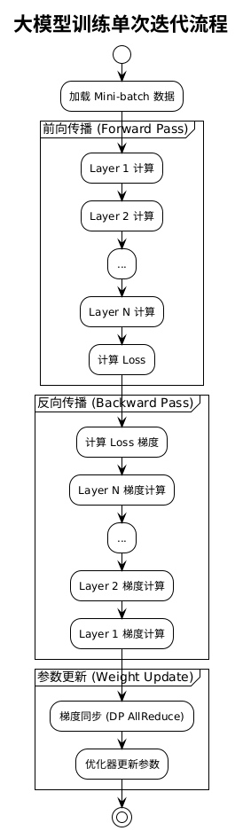
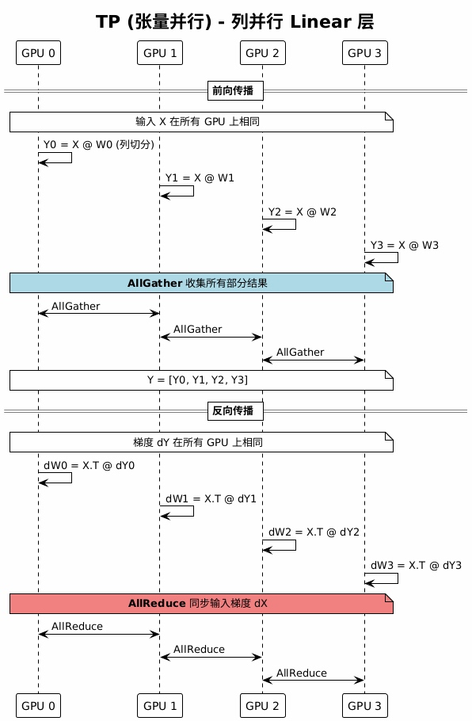
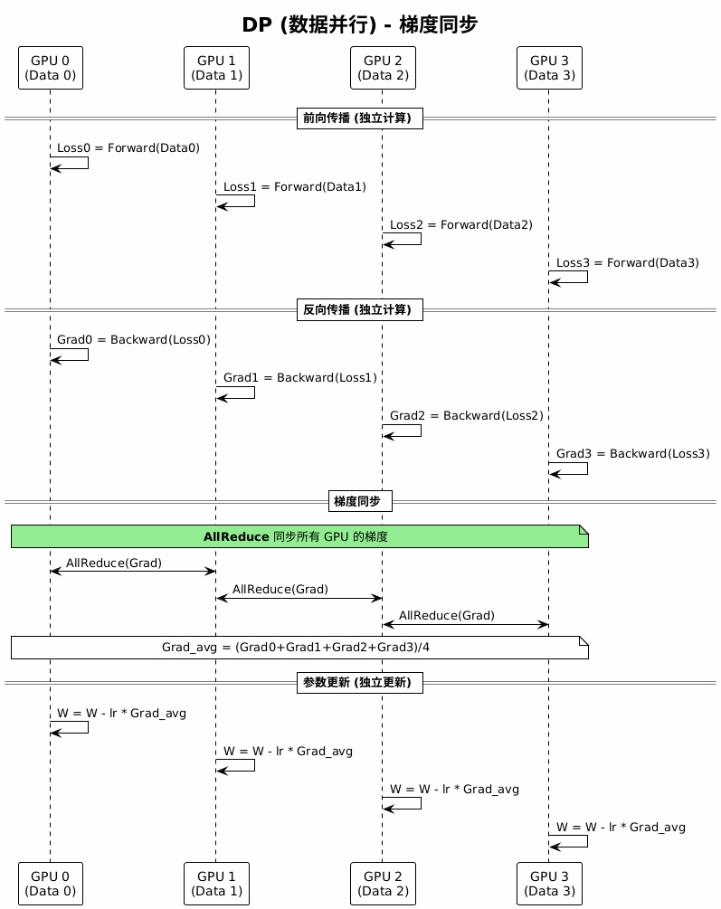
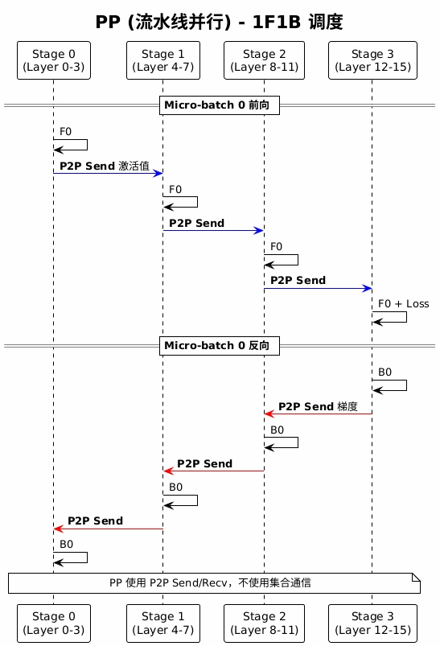
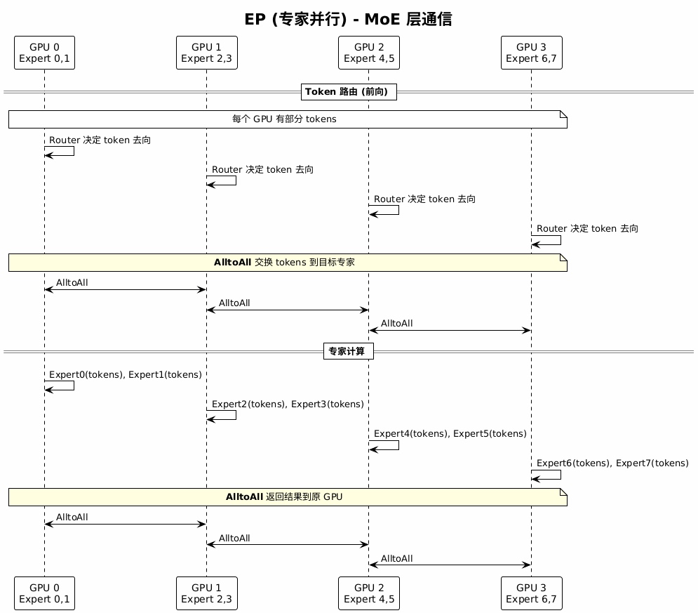
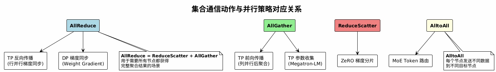
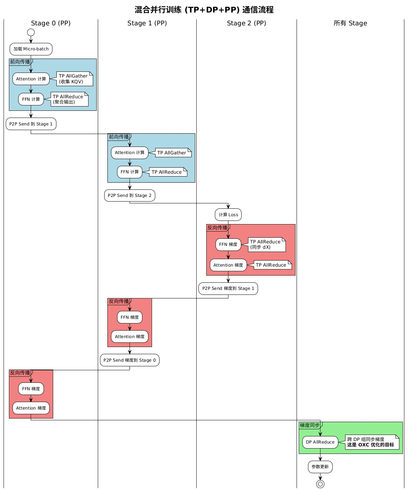

# 大模型训练并行策略与通信分析

本文档分析大模型训练中的并行策略（TP、DP、PP、EP）以及集合通信动作（AllReduce、AllGather、ReduceScatter、AlltoAll）发生的阶段。

## 目录

1. [训练流程概述](#1-训练流程概述)
2. [并行策略与通信阶段](#2-并行策略与通信阶段)
   - [2.1 TP (Tensor Parallelism)](#21-tp-tensor-parallelism---张量并行)
   - [2.2 DP (Data Parallelism)](#22-dp-data-parallelism---数据并行)
   - [2.3 PP (Pipeline Parallelism)](#23-pp-pipeline-parallelism---流水线并行)
   - [2.4 EP (Expert Parallelism)](#24-ep-expert-parallelism---专家并行)
3. [通信动作总结](#3-通信动作总结)
4. [完整训练流程中的通信](#4-完整训练流程中的通信)
5. [通信动作发生阶段总结表](#5-通信动作发生阶段总结表)

---

## 1. 训练流程概述

大模型训练的一个迭代包含三个主要阶段：

---

## 2. 并行策略与通信阶段

### 2.1 TP (Tensor Parallelism) - 张量并行

TP 将单层的参数切分到多个 GPU，发生在**每一层的前向和反向传播中**。

**特点：**
- 通信发生在每一层
- 通常在框内（同一服务器的 GPU 之间）
- 使用 **AllGather**（前向）和 **AllReduce**（反向）

---

### 2.2 DP (Data Parallelism) - 数据并行

DP 每个 GPU 有完整模型副本，处理不同数据，发生在**反向传播结束后**。

**特点：**
- 通信发生在反向传播后
- 通常**跨框**（跨服务器）
- 使用 **AllReduce** 同步梯度
- **这是 OXC 优化的主要目标**

---

### 2.3 PP (Pipeline Parallelism) - 流水线并行

PP 将模型按层切分到不同 GPU，发生在**层与层之间的数据传递**。

**特点：**
- 通信发生在 Stage 之间
- 使用 **P2P Send/Recv**，不使用集合通信
- 可能跨框（取决于 Stage 分布）

---

### 2.4 EP (Expert Parallelism) - 专家并行

EP 用于 MoE (Mixture of Experts) 模型，发生在 **MoE 层的 token 路由**。

**特点：**
- 通信发生在 MoE 层前后
- 使用 **AlltoAll** 交换 tokens
- 可能跨框（取决于专家分布）

---

## 3. 通信动作总结

四种主要集合通信动作与并行策略的对应关系：

---

## 4. 完整训练流程中的通信

混合并行训练 (TP+DP+PP) 中的通信流程：

---

## 5. 通信动作发生阶段总结表

| 通信动作 | 并行策略 | 发生阶段 | 通信组 | 是否跨框 |
|---------|---------|---------|-------|---------|
| AllReduce | TP | 前向/反向每层 | TP 组 | 通常框内 |
| AllReduce | DP | 反向传播后 | DP 组 | **跨框** |
| AllGather | TP | 前向传播 | TP 组 | 通常框内 |
| ReduceScatter | TP/ZeRO | 反向传播 | TP/DP 组 | 视情况 |
| AlltoAll | EP | MoE 层前后 | EP 组 | 视情况 |
| P2P Send/Recv | PP | 层间传递 | 相邻 Stage | 视情况 |

---

## 6. 关键结论

1. **TP 通信**：发生在每层，但通常在框内（同一服务器的 GPU）
2. **DP 通信**：发生在反向传播后，通常跨框 → **OXC 优化目标**
3. **PP 通信**：使用 P2P，不使用集合通信
4. **EP 通信**：使用 AlltoAll，在 MoE 层

### OXC 优化重点

OXC（光交叉连接）主要优化 **DP AllReduce**，因为：
- DP AllReduce 是跨框通信的主要来源
- 数据量大（整个模型的梯度）
- 发生频率高（每个迭代一次）
- 对训练吞吐量影响显著
