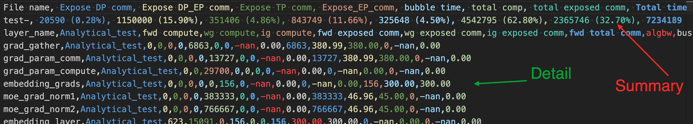
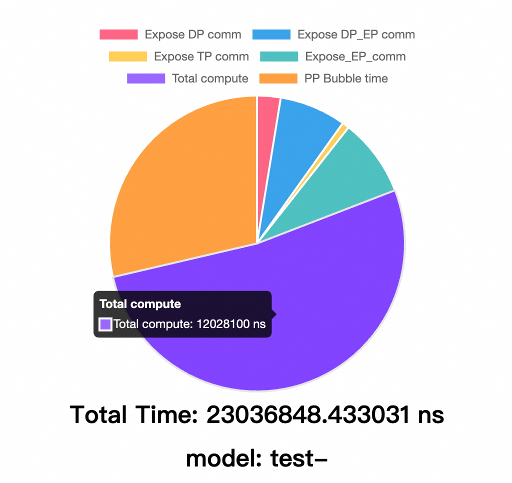
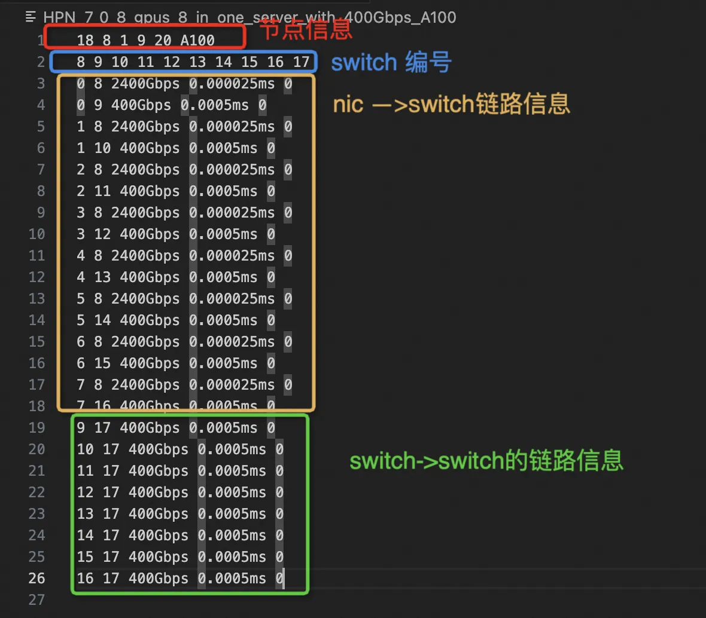

# 🌟 Introduction

SimAI is a comprehensive large-scale AI training simulation toolkit that provides three major simulation scenarios:

1. **SimAI-Analytical** - An analytical simulation tool that abstracts underlying network communication details. It adopts a simplified approach using busbw (bus bandwidth) to estimate communication time for collective/point-to-point communications, enabling rapid scenario validation. Key application scenarios include (but are not limited to):

    * *Performance Analysis*: Compare completion times across different models (e.g., studying the impact of Expert numbers on MoE model training performance)

    * *Framework-level Parallel Parameter Optimization*: Balance and optimize TP/EP/PP parameters to analyze end-to-end timing effects

    * *Scale-up Exploration*: Investigate parallel parameter performance across different scale-up domains for specific scenario optimization

    * *Scale-out Bandwidth Selection*: Research cost-effective bandwidth configurations for various GPU performances

> 💡 *Currently supports manual busbw.yaml configuration. Automatic busbw inference based on parallel scenarios will be open-sourced soon. Stay tuned and feel free to contact us for more details. ✨*

2. **SimAI-Simulation(NS-3)** - A high-fidelity, full-stack simulation tool that can theoretically integrate with any pure network simulator. It provides fine-grained reproduction of communication behaviors during LLM training. Currently supports NS-3 as the network backend (we encourage integration of new network simulation tools). Key research areas include:

    * *Collective Communication Algorithm Research*: Design and optimize collective communication traffic patterns for non-switch architectures and other emerging network topologies
    
    * *Network Protocol Research*: Evaluate and optimize network protocols, congestion control algorithms, routing mechanisms and other low-level network technologies across different architectures
    
    * *Novel Network Architecture Design*: Explore innovative network architectures

> 💡 We strongly encourage researchers to build upon SimAI-Simulation for innovative extensions and breakthrough research suitable for top-tier conferences. Join our community or reach out via email - we're committed to providing technical support for promising research directions! ✨

3. **SimAI-Physical(TODO)**

For additional functionalities of each component, please refer to [SimCCL](https://github.com/aliyun/SimCCL) and [ns-3-alibabacloud](https://github.com/aliyun/ns-3-alibabacloud).

# 🛠️ Environment Setup

Under normal circumstances, running SimAI requires generating a Workload file using the [AICB](https://github.com/aliyun/aicb?tab=readme-ov-file#generate-workloads-for-simulation-simai) tool. To create a precise Workload, you may need to utilize the AIOB feature to determine the timing of various computational kernels, which necessitates a GPU environment. Therefore, we recommend executing the SimAI full-stack toolkit directly within the latest **NGC image**.

> 💡 **Important Note**: SimAI-Simulation compilation requires removing ninja (which comes pre-installed in NGC images). You can remove it using:
> ```bash
> apt remove ninja-build && pip uninstall ninja
> ```

Build Instructions:

```bash
# Clone the repository
$ git clone https://github.com/aliyun/SimAI.git
$ cd ./SimAI/

# Clone submodules
$ git submodule update --init --recursive
# Make sure to use the newest commit
$ git submodule update --remote

# Compile SimAI-Analytical
$ ./scripts/build.sh -c analytical

# Compile SimAI-Simulation (ns3)
$ ./scripts/build.sh -c ns3
```

# 🌐 SimAI-Analytical Usage
## 📝 Workload Generate

To generate workloads for simulation, use the [SimAI-WorkloadGenerator](https://github.com/aliyun/aicb?tab=readme-ov-file#generate-workloads-for-simulation-simai) feature in [AICB](https://github.com/aliyun/aicb). This will produce a `.txt` file similar to [workload_analytical.txt](../example/workload_analytical.txt), which includes:

- `model_parallel_NPU_group`: Represents the size of Tensor Parallelism
- `ep`: Represents the size of Expert model parallelism
- `pp`: Represents the size of pipeline model parallelism
- `vpp`: Virtual Pipeline Parallelism (default: `--num-layers-per-virtual-pipeline-stage=1` for minimal PP bubble)

> 💡 *For more details, refer to the [AICB Workload Tutorial](https://github.com/aliyun/aicb/blob/master/training/tutorial.md#workload)*

## 🔧 Busbw Setting

SimAI-Analytical abstracts lower-level network details by directly specifying busbw to estimate collective communication times. To customize communication busbw for various scenarios, you can use a [busbw.yaml](../example/busbw.yaml) file in the following format:

```yaml
test
TP:
  allreduce,: 300      # AllReduce busbw 300GB/s in TP
  allgather,: 280
  reducescatter,: 280
  alltoall,: 230
DP:
  allreduce,: null
  allgather,: 380      # AllGather busbw 380GB/s in DP
  reducescatter,: 380
  alltoall,: null
EP:
  allreduce,: null
  allgather,: 45       # AllGather busbw 45GB/s in DP_EP
  reducescatter,: 45   # ReduceScatter busbw 45GB/s in DP_EP
  alltoall,: 80        # AlltoAll busbw 80GB/s in EP
```
> 🔍 *Interested in automated busbw calculation (considering cluster size, architecture, parallel parameters, small message adjustments, and latency)? Feel free to reach out for a discussion!* ✨

## 🖥️ Analytical Simulation

To run the analytical simulation, use the following command:

```bash
$ ./bin/SimAI_analytical -w example/workload_analytical.txt -g 9216 -g_p_s 8 -r test- -busbw example/busbw.yaml
```

### Required Parameters

| Parameter | Long Form | Description |
|:---------:|:----------|:------------|
| `-w` | `--workload` | Specifies the path to the Workload File |
| `-g` | `--gpus` | Specifies the simulation GPU scale |
| `-g_p_s` | `--gpus-per-server` | Specifies the Scale-up size |
| `-r` | `--result` | Specifies the output file path and prefix (default: `./results/`)<br>Recommended to include simulation parameters, e.g.,<br>`A100-llama405b-tp8-pp16-dp128-ga16-ep1-NVL8` |
| `-busbw` | `--bus-bandwidth` | Specifies the path to the busbw file<br>(recommend modifying `example/busbw.yaml` directly) |

### Optional Parameters

| Parameter | Long Form | Description |
|:---------:|:----------|:------------|
| `-v` | `--visual` | Specifies whether to generate visualization files |

### Communication Group Overlap Ratios

The following parameters specify the overlap ratios for communication groups (default: 0, indicating no overlap):

| Parameter | Long Form | Description | Range |
|:---------:|:----------|:------------|:------|
| `-dp_o` | `--dp-overlap-ratio` | DP overlap ratio | [0.0-1.0] |
| `-ep_o` | `--ep-overlap-ratio` | EP overlap ratio | [0.0-1.0] |
| `-tp_o` | `--tp-overlap-ratio` | TP overlap ratio | [0.0-1.0] |
| `-pp_o` | `--pp-overlap-ratio` | PP overlap ratio | [0.0-1.0] |

> 📝 *Due to the variety of overlap strategies and scenario-dependent overlap ratios, we prioritize simple and efficient methods to directly specify overlap conditions.*


## Result Analyze

### Raw Data

Running SimAI-Analytical normally will generate a CSV output as shown in the figure below.

The second row contains summary information, including the exposure time and the absolute and percentage of computational time for each communication group, as well as the end-to-end time of one iteration. Below this are details of the operation for each specific layer.




### Visualization

If you specify `-v` when running SimAI-Analytical, the following will be generated:



# SimAI-Simulation Usage
## 📝 Workload Generate

Using the same workload as SimAI-Analytical, generated by [SimAI-WorkloadGenerator](https://github.com/aliyun/aicb?tab=readme-ov-file#generate-workloads-for-simulation-simai) feature in [AICB](https://github.com/aliyun/aicb).

## 🔧 TOPO Setting

Before running SimAI-Simulator, you need to generate a `topo` file that can be recognized by `ns-3-alibabacloud`.

As shown in the figure below, the first row represents various parameters: `node_num` is the total number of nodes, `gpus_per_server` refers to the number of GPUs per server (currently, we bind each NIC to a GPU as a single node), `nvswitch_num` indicates the number of NVSwitch nodes (specifically used to implement the NVLS algorithm), `switch_num` is the number of switches, `link_num` is the total number of connections, and `gpu_type_str` describes the type of GPU.

| Abbreviation       | Description                                     |
|--------------------|-------------------------------------------------|
| `node_num`         | Total number of nodes                           |
| `gpus_per_server`  | Number of GPUs per server                       |
| `nvswitch_num`     | Number of NVSwitch nodes (for NVLS algorithm)   |
| `switch_num`       | Number of switches                              |
| `link_num`         | Total number of connections                     |
| `gpu_type_str`     | Type of GPU                                     |

The following command generates the topology shown in the image:
```bash
python3 ./astra-sim-alibabacloud/inputs/topo/gen_HPN_7.0_topo_mulgpus_one_link.py -g 8 -gt A100 -bw 400Gbps -nvbw 2400Gbps -psn 1 
```


The `link_num` is `20` because each ASW (Aggregation Switch) is connected to a single PSW (Pod Switch, node 17). Since the topology uses `-psn 1` (single-plane topology), only one plane of PSWs is utilized, limiting the connections to `4` between ASWs and PSWs.

To increase the `link_num` to `24`, you need to enable a dual-plane topology by setting `-ps`n to `2` in the command. This will activate both planes of PSWs, doubling the connections between ASWs and PSWs. For example:

```bash
python3 ./astra-sim-alibabacloud/inputs/topo/gen_HPN_7.0_topo_mulgpus_one_link.py -g 8 -gt A100 -bw 400Gbps -nvbw 2400Gbps -psn 2
```

You can choose to customize any `topo` following the format shown above. Of course, we also provide a script to directly generate a `topo` for the HPN architecture.

```bash
python3 ./astra-sim-alibabacloud/inputs/topo/gen_HPN_7.0_topo_mulgpus_one_link.py -g 128 -gt A100 -bw 100Gbps -nvbw 2400Gbps
```

| Parameter        | Description                                | Default Value |
|------------------|--------------------------------------------|---------------|
| `-l  --latency`          | NIC latency                              | 0.0005ms      |
| `-nl  --nv_latency`      | NV switch latency                        | 0.000025ms    |
| `-bw  --bandwidth`       | NIC to ASW bandwidth                     | 100Gbps       |
| `-apbw  --ap_bandwidth`  | ASW to PSW bandwidth                     | 400Gbps       |
| `-nvbw  --nvlink_bw`     | NVLink bandwidth                         | 1700Gbps      |
| `-er  --error_rate`      | Error rate                               | 0             |
| `-g  --gpu`              | Number of GPUs                           | 32            |
| `-gt  --gpu_type`        | GPU type                                 | H800          |
| `-gps  --gpu_per_server` | GPUs per server                          | 8             |
| `-psn  --psw_switch_num` | Number of PSW switches                   | 120           |
| `-nsps  --nv_switch_per_server` | NV switch per server                 | 1             |
| `--dp`                    | Enable dual plane, default single plane  | false         |
| `--st`                    | Enable DCN architecture, default HPN_7_0 | false     |
| `--asn`                   | ASW number                               | 8            |
| `--psn`                   | PSW number                               | 120          |

If the number of GPUs exceeds the number of GPUs in a segment, you should set the number of asn. For example, if you want to generate 4096 GPUs, the number of asn should be 32.

```bash
python3 ./astra-sim-alibabacloud/inputs/topo/gen_HPN_7.0_topo_mulgpus_one_link.py -g 4096 -gt A100 -bw 100Gbps -nvbw 2400Gbps -asn 32
```

## 🖥️ SimAI-NS3 Simulation

```bash
$ AS_SEND_LAT=3 AS_NVLS_ENABLE=1 ./bin/SimAI_simulator -t 16 -w ./example/microAllReduce.txt -n  ./HPN_7_0_128_gpus_8_in_one_server_with_single_plane_100Gbps_A100  -c astra-sim-alibabacloud/inputs/config/SimAI.conf
```

| Environment Variable Name | Description                      | Default Value                             |
|---------------------------|----------------------------------|-------------------------------------------|
| `AS_LOG_LEVEL`            | Log level                        | `DEBUG`, `INFO`, `WARNING`, `ERROR`, `UNKNOWN`; default is `INFO` |
| `AS_PXN_ENABLE`           | Enable PXN                       | `0/1`; default is `false`                 |
| `AS_NVLS_ENABLE`          | Enable NVLS                      | `0/1`; default is `false`                 |
| `AS_SEND_LAT`             | Set packet sending latency       | Default is `6`, unit is `us`              |
| `AS_NVLSTREE_ENABLE`      | Enable NVLSTREE                  | Default is `false`                        |

| Parameter                  | Description                              | Default Value                                                      |
|----------------------------|------------------------------------------|--------------------------------------------------------------------|
| `-t  --thread`            | Number of threads for multithreading acceleration | Default is `1`; if multithreading is enabled, control the number of threads between `8` and `16`. |
| `-w  --workload`          | Path to workload                         | `./microAllReduce.txt`                                             |
| `-n  --network-topo`      | Network topology path                    | None    

## RING VS NVLS
### workload
```bash
HYBRID_TRANSFORMER_FWD_IN_BCKWD model_parallel_NPU_group: 8 ep: 1 pp: 1 vpp: 8 ga: 1 all_gpus: 32 checkpoints: 0 checkpoint_initiates: 0
6
embedding_layer     -1 556000  ALLREDUCE   16777216      1       NONE 0        1      NONE   0      1 
embedding_layer     -1 556000  ALLREDUCE   33554432      1       NONE 0        1      NONE   0      1 
embedding_layer     -1 556000  ALLREDUCE   67108864      1       NONE 0        1      NONE   0      1 
embedding_layer     -1 556000  ALLREDUCE   134217728      1       NONE 0        1      NONE   0      1 
embedding_layer     -1 556000  ALLREDUCE   268435456      1       NONE 0        1      NONE   0      1 
embedding_layer     -1 556000  ALLREDUCE   536870912      1       NONE 0        1      NONE   0      1 

```
### NVLS topo file && RUN
```bash
cd SimAI
./scripts/build.sh -c ns3
python3 ./astra-sim-alibabacloud/inputs/topo/gen_HPN_7.0_topo_mulgpus_one_link.py -g 32 -gt H800 -bw 400Gbps -nvbw 1360Gbps
AS_SEND_LAT=12 AS_NVLS_ENABLE=1 ./bin/SimAI_simulator -t 8 -w ./example/microAllReduce.txt -n HPN_7_0_32_gpus_8_in_one_server_with_single_plane_400Gbps_H800 -c ./astra-sim-alibabacloud/inputs/config/SimAI.conf
```
### RING topo file && RUN
```bash
python3 ./astra-sim-alibabacloud/inputs/topo/gen_HPN_7.0_topo_mulgpus_one_link.py -g 32 -gt H800 -bw 400Gbps -nvbw 1440Gbps
AS_SEND_LAT=2 AS_PXN_ENABLE=1 ./bin/SimAI_simulator -t 8 -w ./example/microAllReduce.txt -n ./HPN_7_0_32_gpus_8_in_one_server_with_single_plane_400Gbps_H800 -c ./astra-sim-alibabacloud/inputs/config/SimAI.conf
```
### result
| msg size | NVLS  | RING  |
|----------|-------|-------|
| 16M      | 148.88| 141.84|
| 32M      | 178.04| 153.68|
| 64M      | 197.38| 160.60|
| 128M     | 208.70| 163.85|
| 256M     | 214.87| 165.72|
| 512M     | 218.09| 166.68|
| 1G       | 219.73| 167.16|
| 2G       | 220.57| 167.40|

## HPN 7.0 architecture VS DCN+ architecture
### workload
```bash
HYBRID_TRANSFORMER_FWD_IN_BCKWD model_parallel_NPU_group: 8 ep: 1 pp: 1 vpp: 8 ga: 1 all_gpus: 256 checkpoints: 0 checkpoint_initiates: 0
1
embedding_layer     -1 556000         NONE 0        1      NONE   0      1 ALLREDUCE   536870912      1
```
### Network Topofile
```bash
# DCN+ topofile
python3 ./astra-sim-alibabacloud/inputs/topo/gen_HPN_7.0_topo_mulgpus_one_link.py -g 256 -gt H800 -bw 400Gbps -nvbw 1440Gbps -asn 2 --st
# HPN7.0 topofile
python3 ./astra-sim-alibabacloud/inputs/topo/gen_HPN_7.0_topo_mulgpus_one_link.py -g 256 -gt H800 -bw 400Gbps -nvbw 1440Gbps
```
### RUN
```bash
# DCN+ run command
AS_SEND_LAT=2 ./bin/SimAI_simulator -t 8 -w ./example/microAllReduce.txt -n ./DCN_256_gpus_8_in_one_server_with_single_plane_400Gbps_H800 -c ./astra-sim-alibabacloud/inputs/config/SimAI.conf
# HPN7.0 run command
AS_SEND_LAT=2 ./bin/SimAI_simulator -t 8 -w ./example/microAllReduce.txt -n ./HPN_7_0_256_gpus_8_in_one_server_with_single_plane_400Gbps_H800 -c ./astra-sim-alibabacloud/inputs/config/SimAI.conf
```
| msg size | HPN 7.0 | DCN   |
|----------|---------|-------|
| 16M      | 33.09   | 28.48 |
| 32M      | 38.57   | 33.80 |
| 64M      | 42.05   | 37.23 |
| 128M     | 44.04   | 38.39 |
| 256M     | 45.10   | 32.033|
| 512M     | 45.67   | 38.37 |

# SimAI-Physical Usage
The current simulator is compatible with the ns3 discrete event simulator as the network backend, as well as the physical network backend for physical packet injection.

## Compile
SimAI-Phy currently uses the roceV2 protocol for traffic generation. The compilation process requires dependencies on libverbs related to the RDMA physical device, as well as the MPI program. Before compilation, please verify that your environment can successfully run the basic RDMA perfetest traffic generation tool and that it supports the related MPI program.
```bash
# Clone the repository
$ git clone https://github.com/aliyun/SimAI.git
$ cd ./SimAI/

# Clone submodules
$ git submodule update --init --recursive
# Make sure to use the newest commit
$ git submodule update --remote

# Compile SimAI-Analytical
$ ./scripts/build.sh -c analytical

# Compile SimAI-Simulation (ns3)
$ ./scripts/build.sh -c ns3

# Compile SimAI-phynet (phynet)
$ sudo yum install openmpi openmpi-devel
$ export MPI_INCLUDE_PATH=/usr/include/openmpi-x86_64/ 
$ export MPI_BIN_PATH=/usr/lib64/openmpi/bin/mpic++	
$ ./scripts/build.sh -c Phy
```
## Workload Generate
The workload required for SimAI-Phy physical traffic generation is the same as that for Sim-Simulation, and it is generated through AICB.

### Example workload
```bash
HYBRID_TRANSFORMER_FWD_IN_BCKWD model_parallel_NPU_group: 2 ep: 1 pp: 1 vpp: 8 ga: 1 all_gpus: 2 checkpoints: 0 checkpoint_initiates: 0
10
mlp_norm    	    -1	1055000	 ALLGATHER	  1073741824	1055000	      NONE	         0	1055000	      NONE	         0	       100
mlp_norm    	    -1	1055000	 ALLGATHER	  1073741824	1055000	      NONE	         0	1055000	      NONE	         0	       100
mlp_norm    	    -1	1055000	 ALLGATHER	  1073741824	1055000	      NONE	         0	1055000	      NONE	         0	       100
mlp_norm    	    -1	1055000	 ALLGATHER	  1073741824	1055000	      NONE	         0	1055000	      NONE	         0	       100
mlp_norm    	    -1	1055000	 ALLGATHER	  1073741824	1055000	      NONE	         0	1055000	      NONE	         0	       100
mlp_norm    	    -1	1055000	 ALLGATHER	  1073741824	1055000	      NONE	         0	1055000	      NONE	         0	       100
mlp_norm    	    -1	1055000	 ALLGATHER	  1073741824	1055000	      NONE	         0	1055000	      NONE	         0	       100
mlp_norm    	    -1	1055000	 ALLGATHER	  1073741824	1055000	      NONE	         0	1055000	      NONE	         0	       100
mlp_norm    	    -1	1055000	 ALLGATHER	  1073741824	1055000	      NONE	         0	1055000	      NONE	         0	       100
mlp_norm    	    -1	1055000	 ALLGATHER	  1073741824	1055000	      NONE	         0	1055000	      NONE	         0	       100
```
## Prepare the hostlist
Here the main task is to prepare the iplist required to start the MPI program, which is different from nccl-test. The number of IPs here should match the actual number of network cards involved in the physical traffic generation, rather than the number of nodes participating in the physical traffic generation.
```bash
33.255.199.130
33.255.199.129
```
## RUN
### MPI Run
```bash 
/usr/lib64/openmpi/bin/mpirun -np 2 -host 33.255.199.130,33.255.199.129 --allow-run-as-root -x AS_LOG_LEVEL=0  ./bin/SimAI_phynet ./hostlist -g 2 -w ./example/microAllReduce.txt
```
The following output indicates that the program has finished running.


## Setting of MPI program parameters

| Parameter        | Description                                           | Default Value |
|------------------|-------------------------------------------------------|---------------|
| -np              | The number of processes.                              | NULL          |
| -host            | IP list                                               | NULL          |
| --allow-run-as-root | Allow MPI programs to run with root privileges.      | FALSE         |
##  Setting of SimAI-phynet parameters

| Parameter        | Description                  | Default Value                                           |
|------------------|------------------------------|----------------------------------------------------------|
| hostlist         | Host IP list                 | NULL                                                     |
| -w --workload    | Path to workload             | ./microAllReduce.txt                                     |
| -i --gid_index   | Network topology path        | 0                                                        |
| -g --gpus        | Number of GPUs               | 8 (should be consistent with the number of IPs in the host IP list) |
