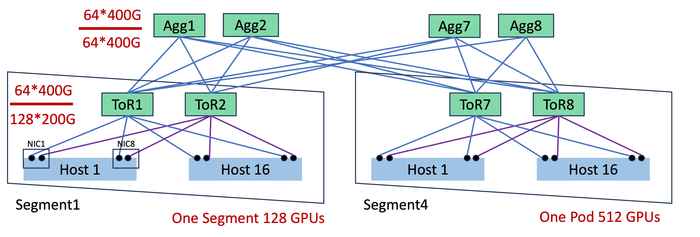
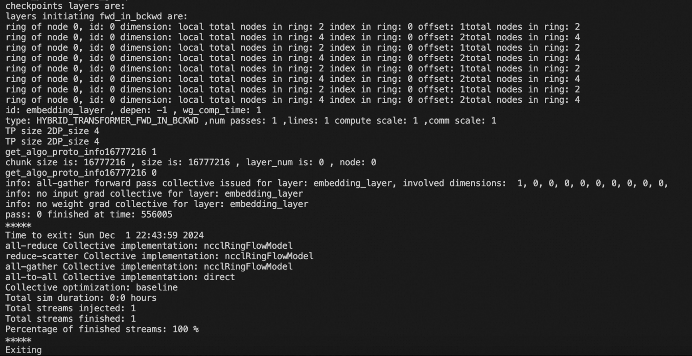

# 🌟 Introduction

SimAI is a comprehensive large-scale AI training simulation toolkit that provides three major simulation scenarios:

1. **SimAI-Analytical** - An analytical simulation tool that abstracts underlying network communication details. It adopts a simplified approach using busbw (bus bandwidth) to estimate communication time for collective/point-to-point communications, enabling rapid scenario validation. Key application scenarios include (but are not limited to):

    * *Performance Analysis*: Compare completion times across different models (e.g., studying the impact of Expert numbers on MoE model training performance)

    * *Framework-level Parallel Parameter Optimization*: Balance and optimize TP/EP/PP parameters to analyze end-to-end timing effects

    * *Scale-up Exploration*: Investigate parallel parameter performance across different scale-up domains for specific scenario optimization

    * *Scale-out Bandwidth Selection*: Research cost-effective bandwidth configurations for various GPU performances

> 💡 *Currently supports manual busbw.yaml configuration. Automatic busbw inference based on parallel scenarios will be open-sourced soon. Stay tuned and feel free to contact us for more details. ✨*

2. **SimAI-Simulation(NS-3)** - A high-fidelity, full-stack simulation tool that can theoretically integrate with any pure network simulator. It provides fine-grained reproduction of communication behaviors during LLM training. Currently supports NS-3 as the network backend (we encourage integration of new network simulation tools). Key research areas include:

    * *Collective Communication Algorithm Research*: Design and optimize collective communication traffic patterns for non-switch architectures and other emerging network topologies
    
    * *Network Protocol Research*: Evaluate and optimize network protocols, congestion control algorithms, routing mechanisms and other low-level network technologies across different architectures
    
    * *Novel Network Architecture Design*: Explore innovative network architectures

> 💡 We strongly encourage researchers to build upon SimAI-Simulation for innovative extensions and breakthrough research suitable for top-tier conferences. Join our community or reach out via email - we're committed to providing technical support for promising research directions! ✨

3. **SimAI-Physical(TODO)**

For additional functionalities of each component, please refer to [SimCCL](https://github.com/aliyun/SimCCL) and [ns-3-alibabacloud](https://github.com/aliyun/ns-3-alibabacloud).

# 🛠️ Environment Setup

Under normal circumstances, running SimAI requires generating a Workload file using the [AICB](https://github.com/aliyun/aicb?tab=readme-ov-file#generate-workloads-for-simulation-simai) tool. To create a precise Workload, you may need to utilize the AIOB feature to determine the timing of various computational kernels, which necessitates a GPU environment. Therefore, we recommend executing the SimAI full-stack toolkit directly within the latest **NGC image**.

> 💡 **Important Note**: SimAI-Simulation compilation requires removing ninja (which comes pre-installed in NGC images). You can remove it using:
> ```bash
> apt remove ninja-build && pip uninstall ninja
> ```

Build Instructions:

```bash
# Clone the repository
$ git clone https://github.com/aliyun/SimAI.git
$ cd ./SimAI/

# Clone submodules
$ git submodule update --init --recursive
# Make sure to use the newest commit
$ git submodule update --remote

# Compile SimAI-Analytical
$ ./scripts/build.sh -c analytical

# Compile SimAI-Simulation (ns3)
$ ./scripts/build.sh -c ns3
```

# 🌐 SimAI-Analytical Usage
## 📝 Workload Generate

To generate workloads for simulation, use the [SimAI-WorkloadGenerator](https://github.com/aliyun/aicb?tab=readme-ov-file#generate-workloads-for-simulation-simai) feature in [AICB](https://github.com/aliyun/aicb). This will produce a `.txt` file similar to [workload_analytical.txt](../example/workload_analytical.txt), which includes:

- `model_parallel_NPU_group`: Represents the size of Tensor Parallelism
- `ep`: Represents the size of Expert model parallelism
- `pp`: Represents the size of pipeline model parallelism
- `vpp`: Virtual Pipeline Parallelism (default: `--num-layers-per-virtual-pipeline-stage=1` for minimal PP bubble)

> 💡 *For more details, refer to the [AICB Workload Tutorial](https://github.com/aliyun/aicb/blob/master/training/tutorial.md#workload)*

## 🔧 Busbw Setting

SimAI-Analytical abstracts lower-level network details by directly specifying busbw to estimate collective communication times. To customize communication busbw for various scenarios, you can use a [busbw.yaml](../example/busbw.yaml) file in the following format:

```yaml
test
TP:
  allreduce,: 300      # AllReduce busbw 300GB/s in TP
  allgather,: 280
  reducescatter,: 280
  alltoall,: 230
DP:
  allreduce,: null
  allgather,: 380      # AllGather busbw 380GB/s in DP
  reducescatter,: 380
  alltoall,: null
EP:
  allreduce,: null
  allgather,: 45       # AllGather busbw 45GB/s in DP_EP
  reducescatter,: 45   # ReduceScatter busbw 45GB/s in DP_EP
  alltoall,: 80        # AlltoAll busbw 80GB/s in EP
```
> 🔍 *Interested in automated busbw calculation (considering cluster size, architecture, parallel parameters, small message adjustments, and latency)? Feel free to reach out for a discussion!* ✨

## 🖥️ Analytical Simulation

To run the analytical simulation, use the following command:

```bash
$ ./bin/SimAI_analytical -w example/workload_analytical.txt -g 9216 -g_p_s 8 -r test- -busbw example/busbw.yaml
```

### Required Parameters

| Parameter | Long Form | Description |
|:---------:|:----------|:------------|
| `-w` | `--workload` | Specifies the path to the Workload File |
| `-g` | `--gpus` | Specifies the simulation GPU scale |
| `-g_p_s` | `--gpus-per-server` | Specifies the Scale-up size |
| `-r` | `--result` | Specifies the output file path and prefix (default: `./results/`)<br>Recommended to include simulation parameters, e.g.,<br>`A100-llama405b-tp8-pp16-dp128-ga16-ep1-NVL8` |
| `-busbw` | `--bus-bandwidth` | Specifies the path to the busbw file<br>(recommend modifying `example/busbw.yaml` directly) |

### Optional Parameters

| Parameter | Long Form | Description |
|:---------:|:----------|:------------|
| `-v` | `--visual` | Specifies whether to generate visualization files |

### Communication Group Overlap Ratios

The following parameters specify the overlap ratios for communication groups (default: 0, indicating no overlap):

| Parameter | Long Form | Description | Range |
|:---------:|:----------|:------------|:------|
| `-dp_o` | `--dp-overlap-ratio` | DP overlap ratio | [0.0-1.0] |
| `-ep_o` | `--ep-overlap-ratio` | EP overlap ratio | [0.0-1.0] |
| `-tp_o` | `--tp-overlap-ratio` | TP overlap ratio | [0.0-1.0] |
| `-pp_o` | `--pp-overlap-ratio` | PP overlap ratio | [0.0-1.0] |

> 📝 *Due to the variety of overlap strategies and scenario-dependent overlap ratios, we prioritize simple and efficient methods to directly specify overlap conditions.*


## Result Analyze

### Raw Data

Running SimAI-Analytical normally will generate a CSV output as shown in the figure below.

The second row contains summary information, including the exposure time and the absolute and percentage of computational time for each communication group, as well as the end-to-end time of one iteration. Below this are details of the operation for each specific layer.


### Visualization

If you specify `-v` when running SimAI-Analytical, the following will be generated:


# SimAI-Simulation Usage
## 📝 Workload Generate

Using the same workload as SimAI-Analytical, generated by [SimAI-WorkloadGenerator](https://github.com/aliyun/aicb?tab=readme-ov-file#generate-workloads-for-simulation-simai) feature in [AICB](https://github.com/aliyun/aicb).

## 🔧 TOPO Setting
Before running SimAI-Simulator, you need to generate a topo file that can be recognized by ns-3-alibabacloud.
### TOPO Templates
To enhance convenience, we provide 5 templates for common architectures, including Spectrum-X, Single Plane AlibabaHPN, Dual Plane Alibaba HPN and DCN+. The parameter `-topo` can be set.These five figures give an overview of them. 
If you want to know more about dual-ToR and dual-plane, please read the article of [HPN 7.0](https://ennanzhai.github.io/pub/sigcomm24-hpn.pdf)
<table>
  <tr>
    <td><br><p>Spectrum-X(One Pod)</p></td>
  </tr>
  <tr>
    <td><br><p>DCN+SingleToR(One Pod)</p></td>
    <td><br><p>DCN+DualToR(One Pod)</p></td>    
  </tr>
  <tr>
    <td><br><p>AlibabaHPN with Single Plane(One Pod)</p></td>
    <td><br><p>AlibabaHPN with Dual Plane(One Pod)</p></td>
    
  </tr>
</table>


The following command generates the Spectrum-X topology with 8 GPUs shown in the image:
```bash
python3 ./astra-sim-alibabacloud/inputs/topo/gen_Topo_Template.py -topo Spectrum-X -g 8 -psn 1
```


The following tables give the description of parameters in layer level, and show the default parameters of each template. Users can change the `-topo` name and corresponding `-g` to generate topology of corresponding structure. Notice that if the gpu num is not enter, then the topology of one Pod of each template will be generated. 
(Gpus more than one pod are not supported right now.)

| Parameter Level | Parameter  | Description |
|-----------------|------------|-------------|
| Whole Structure | `-topo`    | Template for topology |
|                 | `-g`       | Number of GPUs |
|                 | `--dp`     | Enable dual plane, default single plane |
|                 | `--ro`     | Enable rail-optimized |
|                 | `--dt`     | Enable dual nics and dual ToRs |
|                 | `-er`      | Error rate |
| Intra-Host      | `-gps`     | GPU per server |
|                 | `-gt`      | GPU type |
|                 | `-nsps`    | NV switch per server |
|                 | `-nvbw`    | NVLink bandwidth |
|                 | `-nl`      | NVLink latency |
|                 | `-l`       | NIC latency |
| Intra-Segment   | `-bw`      | NIC to ASW bandwidth |
|                 | `-asw`     | ASW switch num |
|                 | `-nps`     | NICs per switch (Connected GPUs per ASW) |
| Intra-Pod       | `-psn`     | PSW switch num |
|                 | `-apbw`    | ASW to PSW bandwidth |
|                 | `-app`     | ASW per PSW |


| Parameter Level | Parameter  | Spectrum-X  | AlibabaHPN_Single_Plane | AlibabaHPN_Dual_Plane | DCN+DualPlane | DCN+SinglePlane |
|-----------------|------------|-------------|-------------------------|-----------------------|---------------|---------------|
| Whole Structure | `-topo`    | `Spectrum-X`| `AlibabaHPN`            | `AlibabaHPN`          | `DCN+`        | `DCN+`        |
|                 | `-g`       | 4096        | 15360                   | 15360                 | 512           | 512           |
|                 | `--dp`     | false       | false                   | true                  | false         | false         |
|                 | `--ro`     | true        | true                    | true                  | false         | false         |
|                 | `--dt`     | false       | true                    | true                  | true          | false         |
|                 | `-er`      | 0           | 0                       | 0                     | 0             | 0             |
| Intra-Host      | `-gps`     | 8           | 8                       | 8                     | 8             | 8             |
|                 | `-gt`      | H100        | H100                    | H100                  | H100          | A100          |
|                 | `-nsps`    | 1           | 1                       | 1                     | 1             | 1             |
|                 | `-nvbw`    | 2880Gbps    | 2880Gbps                | 2880Gbps              | 2880Gbps      | 2880Gbps      |
|                 | `-nl`      | 0.000025ms  | 0.000025ms              | 0.000025ms            | 0.000025ms    | 0.000025ms    |
|                 | `-l`       | 0.0005ms    | 0.0005ms                | 0.0005ms              | 0.0005ms      | 0.0005ms      |
| Intra-Segment   | `-bw`      | 400Gbps     | 200Gbps                 | 200Gbps               | 200Gbps       | 400Gbps       |
|                 | `-asw`     | 64          | 120                     | 120                   | 2             | 1             |
|                 | `-nps`     | 64          | 128                     | 128                   | 128           | 64            |
| Intra-Pod       | `-psn`     | 64          | 120                     | 120                   | 8             | 4             |
|                 | `-apbw`    | 400Gbps     | 400Gbps                 | 400Gbps               | 400Gbps       | 400Gbps       |
|                 | `-app`     | 64          | 240                     | 120                   | 8             | 4             |

Topology of each template can be generated according to different `-topo` name and parameters:
For Dual-Plane AlibabaHPN with 64 gpus, 16 asn and 16 psn, the following command can be used:
```bash
python3 ./astra-sim-alibabacloud/inputs/topo/gen_Topo_Template.py -topo AlibabaHPN --dp -g 64 -asn 16 -psn 16
```
For Dual-ToR DCN, with 128 gpus, 2 asn, 8psn, the following command can be used:
```bash
python3 ./astra-sim-alibabacloud/inputs/topo/gen_Topo_Template.py -topo DCN+ --dt -g 128 -asn 2 -psn 8
```
Please notice that `--ro` `--dt` `--dp` are invalid for `Spectrum-X`(Be set to be Rail-Optimized Single-ToR Single Plane), `--ro` `--dt` are invalid for `AlibabaHPN`(Rail-Optimized Dual Plane, would be Single Plane or Dual Plane), `--ro` `--dp`  are invalid for `DCN+`(No Rail-Optimized Single Plane, would be Single ToR or Dual ToR).

The user can customize the topology themselves. For example, if you want to construct a rail-optimized single ToR topology with 32 GPUs and 200Gbps bandwidth with A100 and 8psn, you can enter the following command:
```bash
python3 ./astra-sim-alibabacloud/inputs/topo/gen_Topo_Template.py -g 32 -bw 200Gbps -gt A100 -psn 8 --ro
```

## 🖥️ SimAI-NS3 Simulation

```bash
$ AS_SEND_LAT=3 AS_NVLS_ENABLE=1 ./bin/SimAI_simulator -t 16 -w ./example/microAllReduce.txt -n  ./Spectrum-X_8g_8gps_400Gbps_H100  -c astra-sim-alibabacloud/inputs/config/SimAI.conf
```

| Environment Variable Name | Description                      | Default Value                             |
|---------------------------|----------------------------------|-------------------------------------------|
| `AS_LOG_LEVEL`            | Log level                        | `DEBUG`, `INFO`, `WARNING`, `ERROR`, `UNKNOWN`; default is `INFO` |
| `AS_PXN_ENABLE`           | Enable PXN                       | `0/1`; default is `false`                 |
| `AS_NVLS_ENABLE`          | Enable NVLS                      | `0/1`; default is `false`                 |
| `AS_SEND_LAT`             | Set packet sending latency       | Default is `6`, unit is `us`              |
| `AS_NVLSTREE_ENABLE`      | Enable NVLSTREE                  | Default is `false`                        |

| Parameter                  | Description                              | Default Value                                                      |
|----------------------------|------------------------------------------|--------------------------------------------------------------------|
| `-t  --thread`            | Number of threads for multithreading acceleration | Default is `1`; if multithreading is enabled, control the number of threads between `8` and `16`. |
| `-w  --workload`          | Path to workload                         | `./microAllReduce.txt`                                             |
| `-n  --network-topo`      | Network topology path                    | None    

## RING VS NVLS
### workload
```bash
HYBRID_TRANSFORMER_FWD_IN_BCKWD model_parallel_NPU_group: 8 ep: 1 pp: 1 vpp: 8 ga: 1 all_gpus: 32 checkpoints: 0 checkpoint_initiates: 0
6
embedding_layer     -1 556000  ALLREDUCE   16777216      1       NONE 0        1      NONE   0      1 
embedding_layer     -1 556000  ALLREDUCE   33554432      1       NONE 0        1      NONE   0      1 
embedding_layer     -1 556000  ALLREDUCE   67108864      1       NONE 0        1      NONE   0      1 
embedding_layer     -1 556000  ALLREDUCE   134217728      1       NONE 0        1      NONE   0      1 
embedding_layer     -1 556000  ALLREDUCE   268435456      1       NONE 0        1      NONE   0      1 
embedding_layer     -1 556000  ALLREDUCE   536870912      1       NONE 0        1      NONE   0      1 

```
### NVLS topo file && RUN
```bash
cd SimAI
./scripts/build.sh -c ns3
python3 ./astra-sim-alibabacloud/inputs/topo/gen_Topo_Template.py --ro -g 32 -gt H100 -bw 400Gbps -nvbw 1360Gbps 
AS_SEND_LAT=12 AS_NVLS_ENABLE=1 ./bin/SimAI_simulator -t 8 -w ./example/microAllReduce.txt -n ./Rail_Opti_SingleToR_32g_8gps_400Gbps_H100 -c ./astra-sim-alibabacloud/inputs/config/SimAI.conf
```
### RING topo file && RUN
```bash
python3 ./astra-sim-alibabacloud/inputs/topo/gen_Topo_Template.py --ro -g 32 -gt H100 -bw 400Gbps -nvbw 1440Gbps
AS_SEND_LAT=2 AS_PXN_ENABLE=1 ./bin/SimAI_simulator -t 8 -w ./example/microAllReduce.txt -n ./Rail_Opti_SingleToR_32g_8gps_400Gbps_H100 -c ./astra-sim-alibabacloud/inputs/config/SimAI.conf
```
### result
| msg size | NVLS   | RING   |
|----------|--------|--------|
| 16M      | 148.88 | 141.84 |
| 32M      | 178.04 | 153.68 |
| 64M      | 197.38 | 160.60 |
| 128M     | 208.70 | 163.85 |
| 256M     | 214.87 | 165.72 |
| 512M     | 218.09 | 166.68 |


## Spectrum-X architecture VS DCN+ architecture
### workload
```bash
HYBRID_TRANSFORMER_FWD_IN_BCKWD model_parallel_NPU_group: 8 ep: 1 pp: 1 vpp: 8 ga: 1 all_gpus: 256 checkpoints: 0 checkpoint_initiates: 0
1
embedding_layer     -1 556000         NONE 0        1      NONE   0      1 ALLREDUCE   536870912      1
```
### Network Topofile
```bash
# DCN+ topofile (Single ToR, non rail-optimized)
python3 ./astra-sim-alibabacloud/inputs/topo/gen_Topo_Template.py -topo DCN+ -g 256 -psn 64 -bw 400Gbps 
# Spectrum topofile (Single ToR, Rail-optimized)
python3 ./astra-sim-alibabacloud/inputs/topo/gen_Topo_Template.py -topo Spectrum-X -g 256
```
### RUN
```bash
# DCN+ run command
AS_SEND_LAT=2 ./bin/SimAI_simulator -t 8 -w ./example/microAllReduce.txt -n ./DCN+SingleToR_256g_8gps_400Gbps_H100 -c ./astra-sim-alibabacloud/inputs/config/SimAI.conf
# HPN7.0 run command
AS_SEND_LAT=2 ./bin/SimAI_simulator -t 8 -w ./example/microAllReduce.txt -n ./Spectrum-X_256g_8gps_400Gbps_H100 -c ./astra-sim-alibabacloud/inputs/config/SimAI.conf
```
| msg size | Spectrum-X  | DCN-SingleToR|
|----------|-------------|--------------|
| 16M      | 33.095585   | 23.332048    |
| 32M      | 38.572166   | 25.762846    |
| 64M      | 42.049648   | 23.677116    |
| 128M     | 44.036110   | 35.209461    |
| 256M     | 45.101425   | 36.205692    |
| 512M     | 45.653648   | 36.242008    |

# SimAI-Physical Usage
The current simulator is compatible with the ns3 discrete event simulator as the network backend, as well as the physical network backend for physical packet injection.

## Compile
SimAI-Phy currently uses the roceV2 protocol for traffic generation. The compilation process requires dependencies on libverbs related to the RDMA physical device, as well as the MPI program. Before compilation, please verify that your environment can successfully run the basic RDMA perfetest traffic generation tool and that it supports the related MPI program.
```bash
# Clone the repository
$ git clone https://github.com/aliyun/SimAI.git
$ cd ./SimAI/

# Clone submodules
$ git submodule update --init --recursive
# Make sure to use the newest commit
$ git submodule update --remote

# Compile SimAI-Analytical
$ ./scripts/build.sh -c analytical

# Compile SimAI-Simulation (ns3)
$ ./scripts/build.sh -c ns3

# Compile SimAI-phynet (phynet)
$ sudo yum install openmpi openmpi-devel
$ export MPI_INCLUDE_PATH=/usr/include/openmpi-x86_64/ 
$ export MPI_BIN_PATH=/usr/lib64/openmpi/bin/mpic++	
$ ./scripts/build.sh -c Phy
```
## Workload Generate
The workload required for SimAI-Phy physical traffic generation is the same as that for Sim-Simulation, and it is generated through AICB.

### Example workload
```bash
HYBRID_TRANSFORMER_FWD_IN_BCKWD model_parallel_NPU_group: 2 ep: 1 pp: 1 vpp: 8 ga: 1 all_gpus: 2 checkpoints: 0 checkpoint_initiates: 0
10
mlp_norm    	    -1	1055000	 ALLGATHER	  1073741824	1055000	      NONE	         0	1055000	      NONE	         0	       100
mlp_norm    	    -1	1055000	 ALLGATHER	  1073741824	1055000	      NONE	         0	1055000	      NONE	         0	       100
mlp_norm    	    -1	1055000	 ALLGATHER	  1073741824	1055000	      NONE	         0	1055000	      NONE	         0	       100
mlp_norm    	    -1	1055000	 ALLGATHER	  1073741824	1055000	      NONE	         0	1055000	      NONE	         0	       100
mlp_norm    	    -1	1055000	 ALLGATHER	  1073741824	1055000	      NONE	         0	1055000	      NONE	         0	       100
mlp_norm    	    -1	1055000	 ALLGATHER	  1073741824	1055000	      NONE	         0	1055000	      NONE	         0	       100
mlp_norm    	    -1	1055000	 ALLGATHER	  1073741824	1055000	      NONE	         0	1055000	      NONE	         0	       100
mlp_norm    	    -1	1055000	 ALLGATHER	  1073741824	1055000	      NONE	         0	1055000	      NONE	         0	       100
mlp_norm    	    -1	1055000	 ALLGATHER	  1073741824	1055000	      NONE	         0	1055000	      NONE	         0	       100
mlp_norm    	    -1	1055000	 ALLGATHER	  1073741824	1055000	      NONE	         0	1055000	      NONE	         0	       100
```
## Prepare the hostlist
Here the main task is to prepare the iplist required to start the MPI program, which is different from nccl-test. The number of IPs here should match the actual number of network cards involved in the physical traffic generation, rather than the number of nodes participating in the physical traffic generation.
```bash
33.255.199.130
33.255.199.129
```
## RUN
### MPI Run
```bash 
/usr/lib64/openmpi/bin/mpirun -np 2 -host 33.255.199.130,33.255.199.129 --allow-run-as-root -x AS_LOG_LEVEL=0  ./bin/SimAI_phynet ./hostlist -g 2 -w ./example/microAllReduce.txt
```
The following output indicates that the program has finished running.



## Setting of MPI program parameters

| Parameter        | Description                                           | Default Value |
|------------------|-------------------------------------------------------|---------------|
| -np              | The number of processes.                              | NULL          |
| -host            | IP list                                               | NULL          |
| --allow-run-as-root | Allow MPI programs to run with root privileges.      | FALSE         |
##  Setting of SimAI-phynet parameters

| Parameter        | Description                  | Default Value                                           |
|------------------|------------------------------|----------------------------------------------------------|
| hostlist         | Host IP list                 | NULL                                                     |
| -w --workload    | Path to workload             | ./microAllReduce.txt                                     |
| -i --gid_index   | Network topology path        | 0                                                        |
| -g --gpus        | Number of GPUs               | 8 (should be consistent with the number of IPs in the host IP list) |
