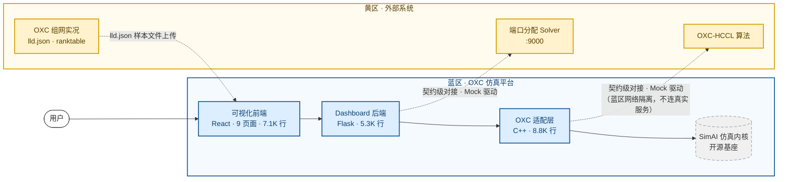

# 蓝区架构定位图

**定位**：基于开源仿真项目 SimAI，打造全面适配 OXC-HCCL 算法、OXC 组网拓扑、端口分配算法的 OXC 仿真平台，同时具备面向用户的可视化前端页面。

---

## 系统架构图

---

## 分层职责

| 层 | 归属 | 组件 | 行数 | 职责 |
|---|---|---|---|---|
| 1. 前端 | 蓝区自研 | React + TypeScript | 7.1K | 用户工作流（9 页面） |
| 2. API 网关 | 蓝区自研 | Flask | 5.3K | workspace / process / edg / auth / monitor |
| 3. OXC 适配层 | 蓝区自研 | C++ | 8.8K | OXC-HCCL 集成、拓扑建模、端口分配消费端 |
| 4. 仿真内核 | 开源基座 | C++（SimAI 上游） | — | analytical / ns3 / phy 三模式 |

## 对外集成接口

| 接口 | 方向 | 蓝区实现 | 说明 |
|---|---|---|---|
| OXC-HCCL | 蓝区 →（契约）→ 黄区 | HTTP 客户端 + Mock | 蓝区按契约实现客户端，开发期走 `AS_OXC_MOCK=1`；真实联调在集成环境 |
| 端口分配（EDG） | 蓝区 →（契约）→ 黄区 | `edg_client.py` + Mock | 蓝区按契约实现客户端，开发期走 `AS_EDG_MOCK=1`；真实联调在集成环境 |
| OXC 组网实况 | 用户 → 蓝区 | 文件上传 | 用户在 TopologyPage 上传 `lld.json` 样本文件，蓝区按文件规约解析 |
