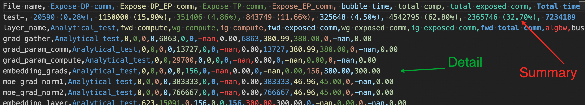
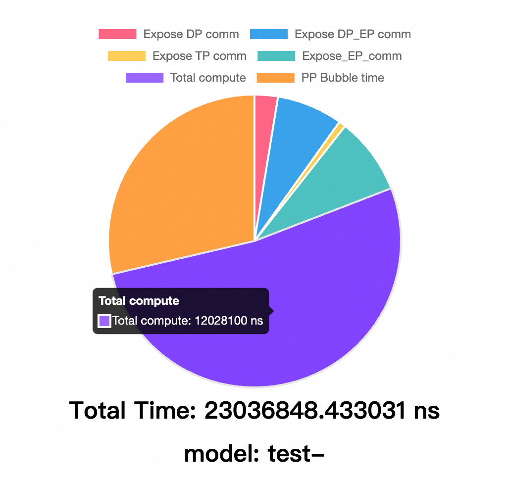

# SimAI-Analytical

SimAI-Analytical offers fast simulation by abstracting network communication details using bus bandwidth (busbw) to estimate collective communication time. It is ideal for rapid scenario validation and performance analysis.

## Use Cases

- **Performance Analysis**: Compare completion times across different models (e.g., impact of expert numbers on MoE training)
- **Parallel Parameter Optimization**: Balance and optimize TP/EP/PP parameters
- **Scale-up Exploration**: Investigate parallel parameter performance across different scale-up domains
- **Scale-out Bandwidth Selection**: Research cost-effective bandwidth configurations

## Workload Generation

Generate workloads using [AICB](workload_generation.md):

```bash
sh ./aicb/scripts/megatron_workload_with_aiob.sh \
    -m 7 --world_size 4096 \
    --tensor_model_parallel_size 2 --pipeline_model_parallel 1 \
    --frame Megatron --global_batch 8192 \
    --micro_batch 1 --seq_length 4096 \
    --swiglu --use_flash_attn --aiob_enable
```

This produces a `.txt` workload file containing:
- `model_parallel_NPU_group`: Tensor Parallelism size
- `ep`: Expert model parallelism size
- `pp`: Pipeline model parallelism size
- `vpp`: Virtual Pipeline Parallelism

> For more details, see [AICB Workload Generation](workload_generation.md) and the [AICB Component Documentation](../components/aicb.md).

## Busbw Configuration

SimAI-Analytical uses a `busbw.yaml` file to specify bus bandwidth for different communication groups:

```yaml
test
TP:
  allreduce,: 300      # AllReduce busbw 300GB/s in TP
  allgather,: 280
  reducescatter,: 280
  alltoall,: 230
DP:
  allreduce,: null
  allgather,: 380      # AllGather busbw 380GB/s in DP
  reducescatter,: 380
  alltoall,: null
EP:
  allreduce,: null
  allgather,: 45
  reducescatter,: 45
  alltoall,: 80        # AlltoAll busbw 80GB/s in EP
```

## Running Analytical Simulation

```bash
./bin/SimAI_analytical \
    -w example/workload_analytical.txt \
    -g 9216 \
    -g_p_s 8 \
    -r test- \
    -busbw example/busbw.yaml
```

### Required Parameters

| Parameter | Long Form | Description |
|:---------:|:----------|:------------|
| `-w` | `--workload` | Path to the workload file |
| `-g` | `--gpus` | Simulation GPU scale |
| `-g_p_s` | `--gpus-per-server` | Scale-up size (GPUs per server) |
| `-r` | `--result` | Output file path and prefix (default: `./results/`) |
| `-busbw` | `--bus-bandwidth` | Path to the busbw file |

### Optional Parameters

| Parameter | Long Form | Description |
|:---------:|:----------|:------------|
| `-v` | `--visual` | Generate visualization files |

### Overlap Ratios

| Parameter | Long Form | Description | Range |
|:---------:|:----------|:------------|:------|
| `-dp_o` | `--dp-overlap-ratio` | DP overlap ratio | [0.0-1.0] |
| `-ep_o` | `--ep-overlap-ratio` | EP overlap ratio | [0.0-1.0] |
| `-tp_o` | `--tp-overlap-ratio` | TP overlap ratio | [0.0-1.0] |
| `-pp_o` | `--pp-overlap-ratio` | PP overlap ratio | [0.0-1.0] |

## Result Analysis

Running SimAI-Analytical generates a CSV output containing:
- Summary row with exposure time, computation time percentages for each communication group, and end-to-end iteration time
- Per-layer operation details



If you specify `-v`, a visualization file is also generated:



For more on result analysis, see [Result Analysis](result_analysis.md).
